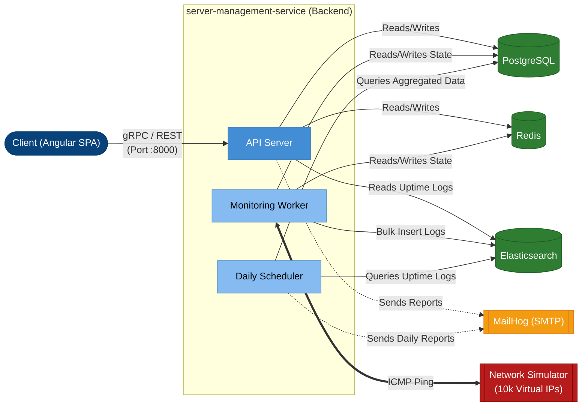

# Server Management System (SMS) - Backend Services

This repository contains the core backend services for the **Server Management System (SMS)**, a robust, high-performance platform designed to monitor the operational status of tens of thousands of servers in real-time. Built around a **Modular Monolith** architecture, it guarantees scalability, maintainability, and fault tolerance.

## 🌟 Key Features

- **Real-Time Uptime Monitoring:** A highly concurrent background worker continuously pings 10,000+ servers via ICMP protocol without blocking API throughput.
- **Bulk Data Processing:** High-speed import/export capabilities for managing server lists via Excel files.
- **Automated Reporting:** Scheduled background jobs calculate uptime statistics from millions of time-series records and automatically send daily reports via email.
- **Polyglot Persistence:** Strategically divides data across PostgreSQL (OLTP), Redis (Cache/Distributed Lock), and Elasticsearch (Time-Series Aggregation) for extreme optimization.
- **Hardware Simulation:** Includes a built-in Network Simulator that mimics 10,000 virtual servers flapping on a private subnet to provide a true-to-life load testing environment.

---

## 🛠 Tech Stack

| Component | Technology | Version | Role |
| :--- | :--- | :--- | :--- |
| **Language** | Go | 1.22+ | High-performance logic processing and goroutine pooling |
| **API Protocol** | gRPC + REST | v2 | Exposes both native gRPC and HTTP REST (via grpc-gateway) |
| **Primary DB** | PostgreSQL | 15 | Relational Database (OLTP), Single Source of Truth |
| **Cache & Lock** | Redis | 7 | High-speed cache, Distributed Lock, Session Revocation |
| **Time-Series DB** | Elasticsearch | 8.17 | Stores observation logs for lightning-fast Uptime aggregation |
| **Email Server** | MailHog | latest | Local SMTP server for testing email notifications |

*(Note: The frontend application is a separate Angular 19 SPA. You can find its repository here: [sms-frontend](https://github.com/dinhdat07/sms-frontend)).*

---

## 🚀 Local Development Setup

To accurately test the pinging mechanism against 10,000 servers, the system includes a `simulator` service. Because ICMP pinging requires elevated privileges (`NET_RAW`) and direct access to the simulator's subnet, the **Monitoring Worker** is best run inside Docker alongside the simulator.

### 1. Prerequisites
- Go 1.22+
- Docker & Docker Compose
- Make (via MinGW on Windows, or natively on Linux/macOS)

### 2. Environment Configuration
Copy the sample environment file to configure your local setup:
```bash
cp .env.example .env
```
*(The default values are already mapped perfectly to the local Docker infrastructure).*

### 3. Start Infrastructure & Simulator
Compile the Linux binaries and spin up the databases, SMTP server, Simulator, and Monitoring Worker inside Docker:
```bash
make docker-up
```
*(To completely shut down and wipe volumes later: `make infra-down`)*

### 4. Run the API & Scheduler Locally
With the infrastructure and Monitoring Worker running in Docker, you can run the API Server and Daily Scheduler directly on your host machine for easier debugging:
```bash
make dev-no-monitor
```
*(This will launch 2 separate command windows running the remaining services).*

---

## 🏛 High-Level Architecture

The system follows a multi-process architecture. Heavy tasks (like pinging and reporting) are completely decoupled from the API Server to prevent network bottlenecks.



---

## 🧪 Testing & Quality Assurance

This project mandates a strict Test-Driven approach using Mocking frameworks (`mockery`). Core business modules (Identity, Monitoring, Reporting, Server Management) are required to maintain a **> 90% Code Coverage**.

Run the test suite using the `Makefile`:
```bash
# Execute all unit tests and print coverage profile to the terminal
make test-coverage

# Generate and open a visual HTML coverage report in your browser
make test-coverage-html
```


