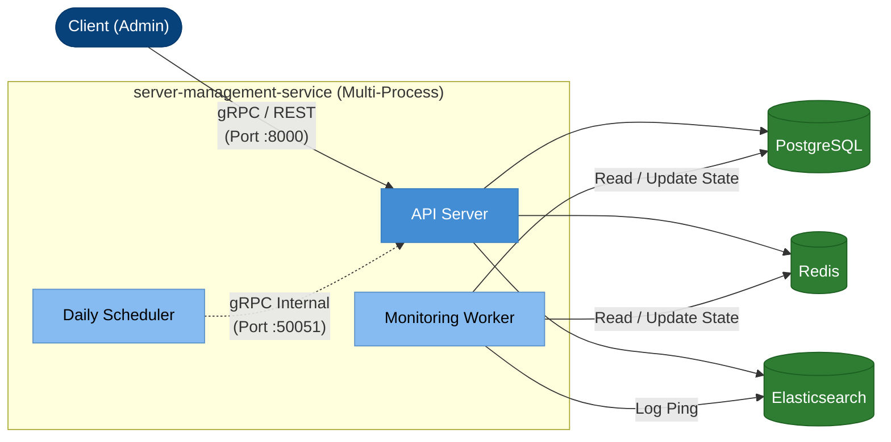

# Server Management Service

`server-management-service` là dịch vụ backend lõi chịu trách nhiệm quản lý vòng đời máy chủ, giám sát trạng thái kết nối thời gian thực và xử lý hệ thống báo cáo bất đồng bộ. Hệ thống được thiết kế theo kiến trúc Modular Monolith (Modulith) tập trung vào hiệu suất cao và khả năng dễ dàng bảo trì.

### Tech Stack

| Thành phần | Công nghệ sử dụng |
|---|---|
| **Ngôn ngữ** | Go 1.22 |
| **Giao tiếp** | gRPC, REST (thông qua `grpc-gateway v2`) |
| **Storage (OLTP)** | PostgreSQL 15 |
| **Cache & Lock** | Redis 7 |
| **Log & Analytics** | Elasticsearch 8 |

---

## Các Tính Năng Cốt Lõi (Core Features)

- **Quản lý vòng đời Server:** Hỗ trợ CRUD, tìm kiếm, phân trang và cơ chế Import/Export dữ liệu lớn hàng loạt (Batch Processing) thông qua file Excel.
- **Giám sát trạng thái thời gian thực:** Sử dụng Background Worker với Goroutine Pool để thực hiện ICMP Ping song song hàng nghìn server. Trạng thái được cập nhật qua State Machine (ONLINE/OFFLINE).
- **Hệ thống sinh báo cáo bất đồng bộ:** Xử lý tính toán Uptime từ hàng triệu bản ghi trong Elasticsearch. Sinh báo cáo HTML và gửi qua Email (SMTP) dưới dạng Async Job.
- **Tự động hóa tác vụ:** Tích hợp Daily Scheduler chạy cron job tự động trigger luồng báo cáo hàng ngày.

---

## Bản Đồ Tài Liệu (Documentation Map)

Để tìm hiểu sâu hơn về dự án, vui lòng tham khảo các tài liệu chuyên đề sau:

| Tài liệu | Mô tả nội dung |
|---|---|
|  [C4_MODEL.md](./docs/C4_MODEL.md) | Sơ đồ kiến trúc hệ thống cấp độ Context, Container, Component, sơ đồ Data Model và thiết kế State Machine. |
|  [USER_GUIDE.md](./docs/USER_GUIDE.md) | Hướng dẫn cài đặt môi trường, danh sách API cURL mẫu, ma trận mã lỗi và kịch bản sửa lỗi (Troubleshooting). |

---

##  Sơ Đồ Kiến Trúc Rút Gọn (High-Level Architecture)



**Chi tiết kỹ thuật & luồng dữ liệu:** Xem tại [C4_MODEL.md](./docs/C4_MODEL.md).

---

## Khởi Chạy Nhanh (Quick Start)

Môi trường Development đã được đóng gói sẵn với `docker-compose` và `Makefile`. Bạn chỉ cần thực hiện 2 bước đơn giản:

```bash
# 1. Khởi động các dependencies (PostgreSQL, Redis, Elasticsearch, MailHog)
make infra-up

# 2. Khởi chạy toàn bộ hệ thống (API Server + Workers)
make dev
```

*(Lệnh `make dev` tự động biên dịch và chạy song song cả 3 tiến trình `cmd/api`, `cmd/monitoring-worker`, và `cmd/daily-scheduler` trong cùng một terminal).*

**Các lệnh hỗ trợ khác (nếu muốn chạy rời từng process):**
- `make run-api`: Chạy riêng API Server.
- `make run-monitor`: Chạy riêng Monitoring Worker.
- `make run-scheduler`: Chạy riêng Daily Scheduler.
- `make infra-down`: Tắt toàn bộ hạ tầng Local.

**Hướng dẫn thiết lập cấu hình `.env` chi tiết:** Xem tại [USER_GUIDE.md](./docs/USER_GUIDE.md).

---

## Kiểm Thử & Chất Lượng (Testing & Quality)

Dự án áp dụng Unit Test nghiêm ngặt với công cụ Mocking (`mockery`). Mục tiêu độ phủ mã (Test Coverage) cho các module lõi là **> 90%**.

### Chạy Kiểm Thử

```bash
# Chạy toàn bộ test suite và sinh báo cáo coverage trên terminal
make test-coverage

# Mở báo cáo coverage trực quan trên trình duyệt
make test-coverage-html
```

### Trạng Thái Coverage Hiện Tại (Current Coverage Matrix)

| Module Core | Component | Trạng thái Coverage | Ghi chú |
|---|---|---|---|
| `identity` | AuthService | ✅ **> 90%** | Đã bao phủ Login, Refresh, Logout, Blacklist. |
| `monitoring` | MonitoringService | ✅ **> 90%** | Đã bao phủ FSM đánh giá trạng thái và Write Amplification logic. |
| `reporting` | ReportingService | ✅ **> 90%** | Đã test Enqueue Job và Update DB status. |
| `reporting` | ReportingWorker | ✅ **> 90%** | Đã test luồng tính Uptime ES và HTML Mailer. |
| `server_mgmt` | ServerService (CRUD) | ✅ **> 90%** | Bao phủ Create, Update, Delete, Search. |
| `server_mgmt` | **ServerService (Import/Export)** | ⏳ **< 90%** | *Cần bổ sung test cho module xử lý file Excel (batch logic & edge cases).* |
| `app/scheduler`| **Cron Trigger** | ⏳ **< 90%** | *Cần bổ sung test cho việc tính toán time window và gọi gRPC client.* |

