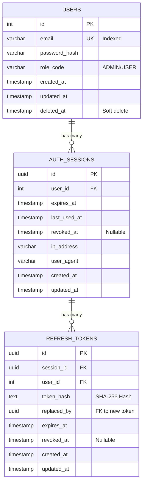
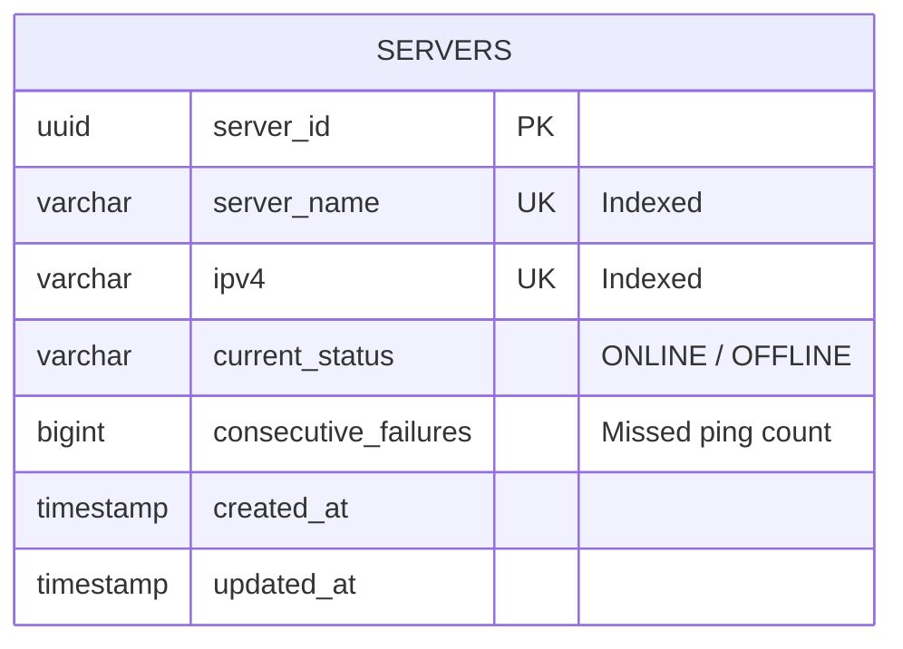
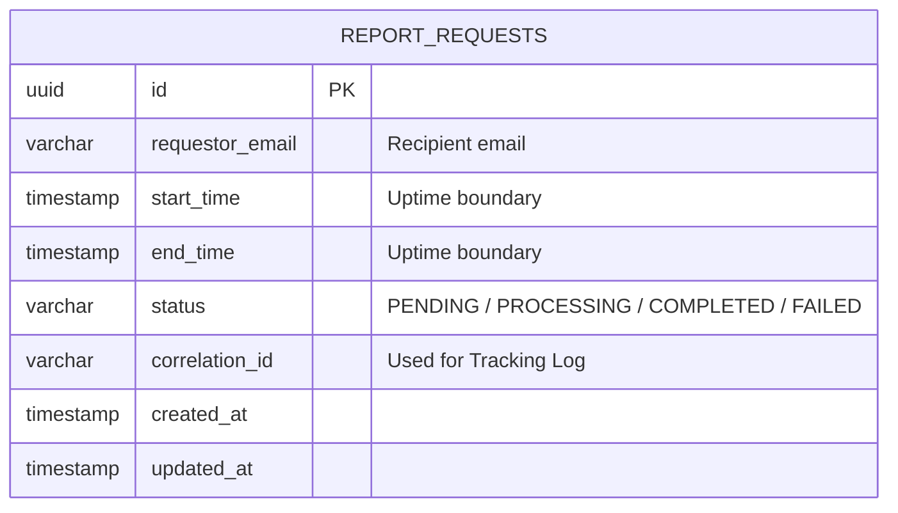
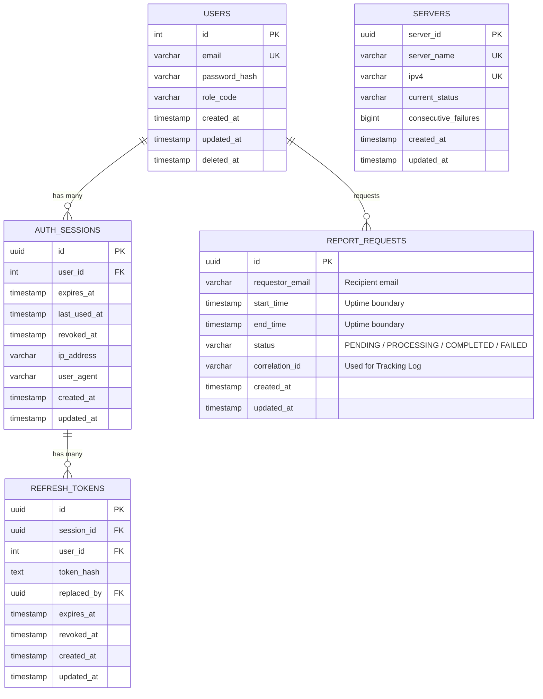

# ARCHITECTURE DESIGN DOCUMENT
**SERVER MANAGEMENT SYSTEM (SMS) - PASSPORT TRAINING PROGRAM**

---

## 1. SYSTEM CONTEXT - LEVEL 1

### 1.1 System Objective
The Server Management System (SMS) is a centralized platform (Modular Monolith) that helps administrators monitor the operating status of thousands of servers in real-time. The system provides features to manage the server list (CRUD, Import/Export Excel), automatic ping monitoring via ICMP protocol, calculate uptime, and send statistical reports via email.

### 1.2 System Context Diagram


*(Note: Insert structurizr-SystemContext.png)*

**Diagram Legend:**
*   **System Administrator (Admin):** The direct user of the system, performing administrative tasks, importing/exporting servers, viewing statistical reports, and receiving alert notifications via email.
*   **Server Management System (SMS):** The central software system, acting as the monitor, data collector, and reporter.
*   **Target Servers (10k+):** Thousands of target servers in the infrastructure that need to be monitored. The system will continuously send ICMP (Ping) packets to these servers to check their alive/dead status (ONLINE/OFFLINE).
*   **SMTP Server:** An external email sending system (like MailHog in the dev environment or SendGrid in production). SMS communicates with SMTP to send periodic or manual uptime reports to the Admin.

---

## 2. CONTAINER DIAGRAM - LEVEL 2


*(Note: Insert structurizr-Containers.png)*

**Container Diagram Legend:**
The system is divided into independent Containers (processes) for easy scaling and isolating heavy tasks:
1.  **Web Application (Frontend):** A Single Page Application written in Angular 19. Communicates with the Backend via REST/gRPC.
2.  **Backend Application (API):** The core process written in Go, serving APIs. It provides both gRPC (for internal clients or grpc-web) and REST (via grpc-gateway).
3.  **Monitoring Worker:** A Background Worker process written in Go. Completely isolated from the API Server so that continuously pinging thousands of servers (ICMP) every 30 seconds does not affect the API serving performance.
4.  **Daily Scheduler:** A process that runs a cron job to automatically trigger the report generation process at 00:00 every day.
5.  **PostgreSQL (Database):** The primary relational database (Single Source of Truth) storing User, Session, and Server Metadata.
6.  **Redis (Cache & Lock):** Temporarily stores the state (status, retry_count) of servers to optimize read speed (O(1)) for the Monitoring Worker. It also acts as a Distributed Lock to prevent collisions between Workers.
7.  **Elasticsearch (Log Storage):** A dedicated Time-series database storing every ping record (Observation Log). This serves ultra-fast Aggregation queries (calculating Uptime) instead of counting rows in Postgres.

### Technology Stack Details
| Layer / Module | Technology | Version | Role |
| :--- | :--- | :--- | :--- |
| **Backend Core** | Go | 1.22+ | Logic processing, high performance, goroutine pool |
| **API Protocol** | gRPC + grpc-gateway | v2 | Provides both native gRPC and HTTP REST simultaneously |
| **Frontend** | Angular | 19 | Single Page Application (SPA) |
| **Primary DB** | PostgreSQL | 15 | Relational Database (OLTP), GORM as ORM |
| **Cache & Lock** | Redis | 7 | Server cache, Distributed Lock, Session Revocation |
| **Time-Series DB** | Elasticsearch | 8.17 | Stores observation logs for uptime Aggregation queries |

---

## 3. COMPONENT DIAGRAMS - LEVEL 3

The system adheres to the **Modular Monolith** architecture. The Backend processes (Containers) are broken down into detailed Components as follows:

### 3.1 Backend Application (API Server) Components

*(Note: Insert structurizr-Backend_Components.png)*

The API Server consists of 3 main business modules (Identity, Server Management, Reporting) and 1 auxiliary module (Notification). **Architectural Decision:** Adopting the Layered Architecture model (Handler -> Service -> Repository) combined with Dependency Injection. The components are loosely coupled via internal Interfaces, making the system extremely easy to Unit Test (Mocking) and extend features.

### 3.2 Monitoring Worker Components

*(Note: Insert structurizr-MonitorWorker_Components.png)*

Designed using the **Goroutine Worker Pool** model combined with the `pro-bing` library. The system sets a Concurrency Limit instead of spawning infinite goroutines, preventing RAM overflow and Network Congestion. I/O is optimized using an internal Finite State Machine (FSM) and Bulk Insert.

### 3.3 Daily Scheduler Components

*(Note: Insert structurizr-Scheduler_Components.png)*

A lightweight in-memory process that uses a Cronjob to automatically trigger Report requests. **Architectural Decision:** Detaching the Scheduler into a process completely independent of the API Server ensures Fault Tolerance. When the API Server needs to restart or scale up/down, scheduled tasks are neither interrupted nor duplicated.

---

## 4. DETAILED PROCESSING FLOWS & DATABASE (DYNAMIC VIEWS - LEVEL 4)

This section delves into the Sequence Diagram for each specific business flow and the corresponding Schema design.

### 4.1 Identity Management Business Logic

**Description:** Responsible for authentication, issuing JWTs, and managing Refresh Tokens with an **Anti-Replay Attack** mechanism.

#### 4.1.1 Sequence Diagrams

**A. Login Flow**


**B. Verify Token Flow (Verify Token Middleware)**

*The Middleware always checks if the token has been Revoked in Redis before allowing the request to proceed.*

**C. Refresh Token Flow (Anti-Replay Attack Mechanism)**

*If an expired/revoked Token is intentionally reused, the system will Logout All sessions of that user.*

**D. Logout Flow**


#### 4.1.2 Database Design (Identity)

**ERD Diagram (Identity)**


**Data Dictionary**

*Table `USERS`*
| Column | Type | Constraints | Description |
| :--- | :--- | :--- | :--- |
| `id` | INT/UINT | PK | Auto-increment primary key (gorm.Model) |
| `email` | VARCHAR | UK, Indexed | Used for login |
| `password_hash` | VARCHAR | | Hashed password (Bcrypt) |
| `role_code` | VARCHAR | | Role classification (e.g., ADMIN) |
| `created_at / updated_at` | TIMESTAMP | | Creation/update timestamps |
| `deleted_at` | TIMESTAMP | Indexed | Used for Soft Delete mechanism |

*Table `AUTH_SESSIONS`*
| Column | Type | Constraints | Description |
| :--- | :--- | :--- | :--- |
| `id` | UUID | PK | Session primary key |
| `user_id`| INT/UINT | FK, Indexed | Foreign key pointing to USERS |
| `expires_at` | TIMESTAMP | | Expiration time |
| `last_used_at` | TIMESTAMP | | Last time the Session was used |
| `revoked_at` | TIMESTAMP | Nullable | Time revoked by admin. Valid if NULL. |
| `ip_address` | VARCHAR | | IP of the login device |
| `user_agent` | VARCHAR | | Browser/App information |
| `created_at / updated_at` | TIMESTAMP | | System timestamps |

*Table `REFRESH_TOKENS`*
| Column | Type | Constraints | Description |
| :--- | :--- | :--- | :--- |
| `id` | UUID | PK | Token primary key |
| `session_id`| UUID | FK, Indexed | Foreign key pointing to AUTH_SESSIONS |
| `user_id`| INT/UINT | FK, Indexed | Denormalized foreign key pointing to USERS |
| `token_hash`| TEXT | UK, Indexed | SHA-256 hash string of the Refresh Token |
| `expires_at` | TIMESTAMP | | Expiration time |
| `revoked_at` | TIMESTAMP | Nullable | Time revoked by admin |
| `replaced_by` | UUID | FK, Nullable | Rotation mechanism: Points to the new token ID |
| `created_at / updated_at` | TIMESTAMP | | System timestamps |

**Redis Cache (Identity)**
| Key Pattern | Data Type | TTL | Purpose |
| :--- | :--- | :--- | :--- |
| `revoked_session:{id}` | STRING | Per Token expiry | Blocks revoked sessions, Anti-Replay Attack. |

---

### 4.2 Server Management Business Logic

**Description:** Provides CRUD APIs and Excel Import/Export. Applies **Dual-Write** techniques to both PostgreSQL and Redis so the Monitoring Worker can fetch data extremely fast.

#### 4.2.1 Sequence Diagrams

**A. Search & Pagination Flow (List Servers)**


**B. Creation Flow (Create Server)**


**C. Update & Delete Flow**


*Note: All Create/Update/Delete operations are Dual-written to Redis.*

**D. Bulk Excel Import Flow (Import)**

*I/O optimization using Batch Insert in Postgres and Redis Pipeline.*

**E. Excel Export Flow (Export)**

*Processed synchronously on the HTTP Request thread. RAM is optimized using the StreamWriter technique from the `excelize` library, allowing streaming data directly to the Buffer instead of loading all data into memory.*

#### 4.2.2 Database Design (Server Management)

**ERD Diagram (Server Management)**


**Data Dictionary**

*Table `SERVERS`*
| Column | Type | Constraints | Description |
| :--- | :--- | :--- | :--- |
| `server_id` | UUID | PK | Server primary key identifier |
| `server_name` | VARCHAR | UK, Indexed | Server display name |
| `ipv4` | VARCHAR(15)| UK, Indexed | Must be a valid IPv4 format |
| `current_status` | VARCHAR | | ONLINE or OFFLINE |
| `consecutive_failures`| BIGINT | | Consecutive failed ping count |
| `created_at / updated_at` | TIMESTAMP | | System timestamps |

**Redis Dual-Write (Server Management)**
| Key Pattern | Data Type | TTL | Purpose |
| :--- | :--- | :--- | :--- |
| `server:all_ids` | SET | Infinite | Stores all UUIDs for the Worker to fetch into RAM using `SMEMBERS`. |
| `server:info:{id}` | HASH | Infinite | Stores `{ ipv4, status, retry_count }`. Uses `HGET` to fetch info instantly. |

---

### 4.3 Server Monitoring Business Logic (Monitoring Worker)

**Description & Architectural Decision:** A distributed background process automatically triggered every 30s. Applies the **Goroutine Worker Pool** model: Thousands of Ping tasks (Jobs) are pushed into a Buffered Channel. A fixed number of Workers continuously consume tasks from this Channel. This design maximizes Golang's multithreading capability (Concurrency) while strictly controlling hardware resources (CPU/RAM/Network) to avoid bottlenecks.

#### 4.3.1 Sequence Diagrams

**A. ICMP Ping Flow (Ping Cycle)**

*Applies Write Amplification Reduction algorithm: Postgres DB is only updated when the server actually changes state. Elasticsearch stores all logs via Bulk API.*

#### 4.3.2 Caching & Lock Design (Redis)

**Redis Distributed Lock (Monitoring)**
| Key Pattern | Data Type | TTL | Purpose |
| :--- | :--- | :--- | :--- |
| `lock:monitoring_worker` | STRING (NX) | 25s | Distributed Lock (Mutex) prevents multiple Monitoring Worker processes from running concurrently causing duplicate ping schedules (configured by env var `MONITORING_WORKER_LOCK_KEY`). |

#### 4.3.3 Data Store Design (Elasticsearch)

Tens of thousands of ping packets per minute will bloat the relational DB. Therefore, all Observation Logs are pushed to Elasticsearch using Bulk API.

**Index: `sms_observation_logs`**

| Field | JSON Type | ES Mapping Type | Purpose |
| :--- | :--- | :--- | :--- |
| `server_id` | String | `keyword` | Must be `keyword` to allow Group-by Aggregation when calculating Uptime ratio. |
| `is_success` | Boolean | `boolean` | Used to filter successful / failed pings. |
| `timestamp` | String | `date` | Serves Range queries to export monthly/quarterly reports. |

```json
{
  "mappings": {
    "properties": {
      "server_id": { "type": "keyword" },
      "is_success": { "type": "boolean" },
      "timestamp": { "type": "date" }
    }
  }
}
```

---

### 4.4 Reporting & Alerting Business Logic (Reporting & Notification)

**Description & Architectural Decision:** Delegates all heavy tasks (Uptime calculation on Elasticsearch, HTML rendering, SMTP calling) to the **Background Worker Process**. The API Handler merely pushes Jobs into a Buffered Channel and immediately returns 200 OK (Non-blocking I/O). This design helps the API Server maintain high Throughput and endure heavy loads well.

#### 4.4.1 Sequence Diagrams

**A. Admin Request Report Flow (Manual Request)**

*The request immediately returns 200 OK, while heavy tasks are queued (Channel).*

**B. Automated Scheduling Flow (Scheduled Request)**


**C. Background Processing & Email Sending Flow (Background Worker Process)**

*The worker picks up the Job to calculate Uptime based on Elasticsearch Aggregation, renders HTML, and calls the Notification Module to fire the email.*

#### 4.4.2 Database Design (Reporting)

**ERD Diagram (Reporting)**


**Data Dictionary**

*Table `REPORT_REQUESTS`*
| Column | Type | Constraints | Description |
| :--- | :--- | :--- | :--- |
| `id` | UUID | PK | Primary key |
| `status` | VARCHAR | | PENDING / PROCESSING / COMPLETED / FAILED |
| `correlation_id` | VARCHAR | Indexed | Used to trace logs on ELK |
| `created_at / updated_at` | TIMESTAMP | | System timestamps |

---

## 5. GLOBAL DATA ARCHITECTURE OVERVIEW

The Server Management System (SMS) is designed with a **Polyglot Persistence** mindset, where each storage technology is meticulously chosen to solve a specific problem, instead of cramming everything into a single database.

### 5.1. Polyglot Persistence Strategy

*   **PostgreSQL (Relational - OLTP):** Acts as the *Single Source of Truth* for the entire system. Ensures integrity (ACID) for identity data (Users/Sessions) and Server Metadata. This database is highly normalized and partitioned by Schema (Bounded Context).
*   **Redis (In-memory - Key/Value):** Serves to optimize speed boundaries and resource contention:
    *   *Identity:* Blocks Anti-Replay Attacks by temporarily storing recently revoked Tokens.
    *   *Server Management:* High-speed caches all Server states (Status, IPv4, Failures) with O(1) retrieval time.
    *   *Monitoring:* Acts as a Distributed Lock (Mutex) to ensure background processes don't step on each other.
*   **Elasticsearch (Time-Series / Search Engine):** Handles the data growth problem. Completely decoupling tens of millions of Ping Log records (Observation Logs) from the relational DB helps the system hyper-optimize grouping query capabilities (Aggregation) when calculating the Uptime ratio.

### 5.2. Global Relational Data Diagram (Global ERD - PostgreSQL)

Below is the big picture connecting all relational tables in the system to provide an overview for DBAs (See section 4.x for detailed Data Dictionary).



### 5.3. Data Flow & Synchronization Strategy

To keep the above three database systems consistently running, Architects established the following synchronization flows:
1.  **Dual-write Mechanism (Postgres + Redis):** Whenever there's a Create/Update/Delete Server operation on PostgreSQL, the system executes a Transaction or Pipeline to immediately overwrite the corresponding information to the Redis Cache. This ensures the Monitoring Worker always reads the freshest data.
2.  **Write Amplification Reduction Mechanism (Postgres):** The Monitoring process only updates the Postgres DB if and only if the server **actually changes state** (From ONLINE to OFFLINE or vice versa), instead of continuously updating the DB on every ping.
3.  **Asynchronous Logging Mechanism (Elasticsearch):** The Monitoring Worker does not write ping logs directly to the DB. Instead, data is pushed into a Buffered Channel (Goroutine), then Bulk Inserted to Elasticsearch in Batches (every few seconds). This Fire-and-forget architecture keeps the ICMP Ping flow extremely graceful and unbottlenecked by network I/O.

---

## 6. SECURITY & RATE LIMITING

The system is designed with a multi-layered defense mechanism via a chain of **gRPC Interceptors** and Middlewares, particularly a strict Rate Limiting mechanism to defend against DDoS and Brute-force attacks:

### 6.1. Rate Limiting
Uses **Redis** as a distributed counter storage. Limits are divided into 2 levels:

*   **Pre-Auth Rate Limit (By IP):** Blocks abusive anonymous requests before the system spends CPU parsing Tokens.
    *   **Login:** 5 requests / minute (Prevents password brute-forcing).
    *   **Refresh Token:** 30 requests / minute.
*   **Post-Auth Rate Limit (By UserID):** Logically allocates resources among logged-in Users.
    *   **Import Server / Upload:** 5 requests / minute (Because Excel files consume a lot of RAM).
    *   **Request Report:** 10 requests / minute.
    *   **Delete Server:** 20 requests / minute (Prevents destructive behavior).
    *   **Create / Update Server:** 60 requests / minute.
    *   **View Servers (Read):** 120 requests / minute.
    *   **Global (Default for other APIs):** 300 requests / minute.

### 6.2. Other Protection Layers
*   **Authentication (JWT):** Requires valid Tokens along with an Anti-Replay Attack mechanism via Token Blacklist (Redis).
*   **CSRF Protection:** Blocks cross-site request forgery attacks via browsers.
*   **RBAC (Role-Based Access Control):** Authorizes based on User Role (Admin, Editor, Viewer).
