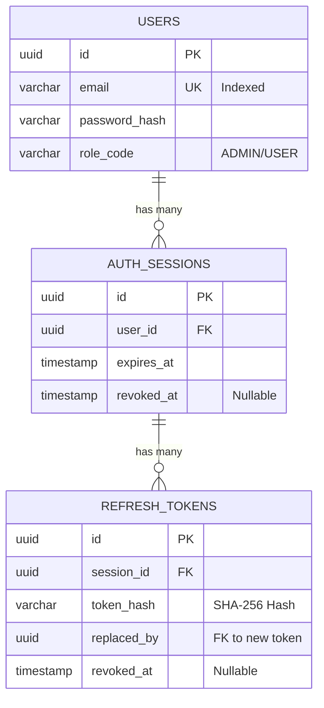
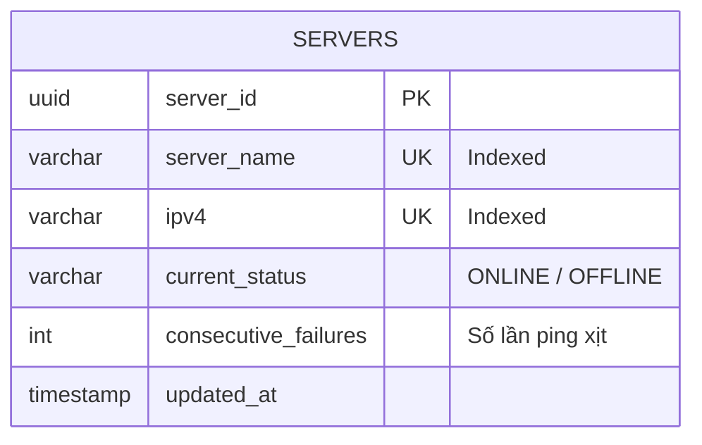
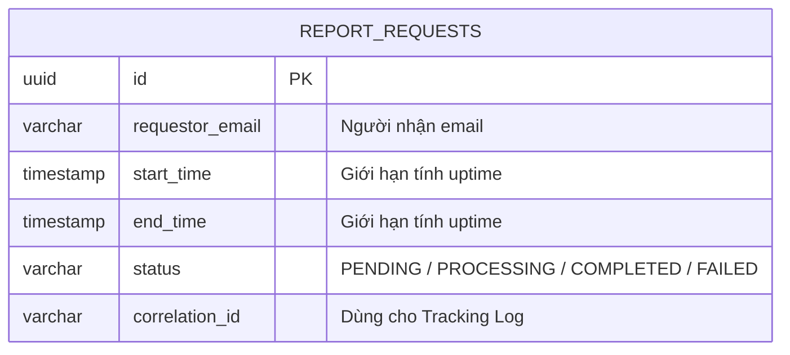

# TÀI LIỆU THIẾT KẾ KIẾN TRÚC
**HỆ THỐNG QUẢN LÝ SERVER (-SMS) - CHƯƠNG TRÌNH ĐÀO TẠO  PASSPORT**

---

## 1. MÔ HÌNH NGỮ CẢNH (SYSTEM CONTEXT - LEVEL 1)

### 1.1 Mục tiêu hệ thống
Hệ thống Quản lý Server (-SMS) là một nền tảng tập trung (Modular Monolith) giúp quản trị viên theo dõi trạng thái hoạt động của hàng nghìn máy chủ theo thời gian thực. Hệ thống cung cấp các tính năng quản lý danh sách server (CRUD, Import/Export Excel), tự động ping giám sát qua giao thức ICMP, tính toán uptime và gửi báo cáo thống kê qua email.

### 1.2 Sơ đồ System Context

*(Ghi chú: Chèn hình ảnh structurizr-SystemContext.png)*

**Chú thích sơ đồ:**
*   **System Administrator (Admin):** Người dùng trực tiếp của hệ thống, thực hiện các thao tác quản trị, import/export server, xem báo cáo thống kê và nhận thông báo cảnh báo qua email.
*   **Server Management System (-SMS):** Hệ thống phần mềm trung tâm, đóng vai trò giám sát, thu thập dữ liệu và báo cáo.
*   **Target Servers (10k+):** Hàng nghìn máy chủ đích nằm trong hạ tầng cần được giám sát. Hệ thống sẽ liên tục gửi gói tin ICMP (Ping) đến các server này để kiểm tra trạng thái sống/chết (ONLINE/OFFLINE).
*   **SMTP Server:** Hệ thống gửi email bên ngoài (như MailHog trong môi trường dev hoặc SendGrid trên production). -SMS giao tiếp với SMTP để gửi báo cáo uptime định kỳ hoặc manual cho Admin.

---

## 2. KIẾN TRÚC TỔNG THỂ (CONTAINER DIAGRAM - LEVEL 2)

*(Ghi chú: Chèn hình ảnh structurizr-Containers.png)*

**Chú thích sơ đồ Container:**
Hệ thống được chia thành các Container (tiến trình) độc lập để dễ dàng scale và isolate các tác vụ nặng:
1.  **Web Application (Frontend):** Ứng dụng Single Page Application viết bằng Angular 19. Giao tiếp với Backend qua REST/gRPC.
2.  **Backend Application (API):** Tiến trình core viết bằng Go, phục vụ API. Cung cấp cả gRPC (cho client nội bộ hoặc grpc-web) và REST (qua grpc-gateway).
3.  **Monitoring Worker:** Tiến trình chạy ngầm (Background Worker) viết bằng Go. Tách biệt hoàn toàn khỏi API Server để việc ping hàng nghìn server (ICMP) liên tục mỗi 30 giây không làm ảnh hưởng đến hiệu năng phục vụ API.
4.  **Daily Scheduler:** Tiến trình chạy cron job tự động kích hoạt tiến trình tạo báo cáo vào lúc 00:00 mỗi ngày.
5.  **PostgreSQL (Database):** CSDL quan hệ chính (Single Source of Truth) lưu trữ thông tin User, Session và Metadata của Server.
6.  **Redis (Cache & Lock):** Lưu trữ tạm thời trạng thái (status, retry_count) của server để tối ưu tốc độ đọc (O(1)) cho Monitoring Worker. Đồng thời dùng làm Distributed Lock để tránh đụng độ giữa các Worker.
7.  **Elasticsearch (Log Storage):** CSDL Time-series chuyên dụng lưu trữ từng bản ghi ping (Observation Log). Phục vụ cho việc query Aggregation (tính Uptime) cực nhanh thay vì đếm row trên Postgres.

### Chi tiết các khối công nghệ
| Lớp / Phân hệ | Công nghệ | Phiên bản | Vai trò |
| :--- | :--- | :--- | :--- |
| **Backend Core** | Go | 1.22+ | Xử lý logic, hiệu năng cao, goroutine pool |
| **API Protocol** | gRPC + grpc-gateway | v2 | Cung cấp song song gRPC native và REST HTTP |
| **Frontend** | Angular | 19 | Single Page Application (SPA) |
| **Primary DB** | PostgreSQL | 15 | Cơ sở dữ liệu quan hệ (OLTP), GORM làm ORM |
| **Cache & Lock** | Redis | 7 | Server cache, Distributed Lock, Session Revocation |
| **Time-Series DB** | Elasticsearch | 8.17 | Lưu observation logs để query Aggregation uptime |

---

## 3. KIẾN TRÚC THÀNH PHẦN (COMPONENT DIAGRAMS - LEVEL 3)

Hệ thống tuân thủ kiến trúc **Modular Monolith**. Các tiến trình (Container) ở Backend được bóc tách chi tiết thành các Component như sau:

### 3.1 Các Component của Backend Application (API Server)

*(Ghi chú: Chèn hình ảnh structurizr-Backend_Components.png)*

API Server chứa 3 module nghiệp vụ chính (Identity, Server Management, Reporting). Mỗi module đều tuân thủ mô hình Handler -> Service -> Repository. Các Service gọi chéo nhau thông qua Interface nội bộ.

### 3.2 Các Component của Monitoring Worker

*(Ghi chú: Chèn hình ảnh structurizr-MonitorWorker_Components.png)*

Được thiết kế xoay quanh Goroutine Pool và thư viện `pro-bing`. Quản lý trạng thái bằng State Machine nội bộ (FSM) và giới hạn Write DB thông qua Bulk Insert và Redis Dual-Write.

### 3.3 Các Component của Daily Scheduler

*(Ghi chú: Chèn hình ảnh structurizr-Scheduler_Components.png)*

Tiến trình rất nhỏ gọn, sử dụng Cronjob để tự động giả lập request Báo cáo của Admin, đẩy việc xuống Database để Reporting Worker xử lý.

---

## 4. LUỒNG XỬ LÝ CHI TIẾT & DATABASE (DYNAMIC VIEWS - LEVEL 4)

Phần này đi sâu vào Sequence Diagram (Sơ đồ tuần tự) của từng luồng nghiệp vụ cụ thể và thiết kế Schema tương ứng.

### 4.1 Nghiệp vụ Quản lý định danh (Identity)

**Mô tả:** Đảm nhiệm việc chứng thực, cấp phát JWT, và quản lý Refresh Token với cơ chế **Anti-Replay Attack**.

#### 4.1.1 Các luồng xử lý (Sequence Diagrams)

**A. Luồng Đăng nhập (Login)**

**B. Luồng Xác thực Token (Verify Token Middleware)**

*Middleware luôn check token có bị Revoked trong Redis hay không trước khi cho phép request đi tiếp.*

**C. Luồng Refresh Token (Cơ chế chống Replay Attack)**

*Nếu phát hiện một Token đã hết hạn/bị thu hồi nhưng vẫn cố tình dùng lại, hệ thống sẽ Logout All mọi phiên của user đó.*

**D. Luồng Đăng xuất (Logout)**

#### 4.1.2 Thiết kế Database (Identity)

**Redis Cache:** Key `revoked_session:{session_id}` dùng để chặn các session đã bị đăng xuất với tốc độ truy xuất O(1).

---

### 4.2 Nghiệp vụ Quản lý Server (Server Management)

**Mô tả:** Cung cấp API CRUD và Import/Export Excel. Ứng dụng kỹ thuật **Dual-Write** xuống cả PostgreSQL và Redis để Monitoring Worker có thể lấy dữ liệu cực nhanh.

#### 4.2.1 Các luồng xử lý (Sequence Diagrams)

**A. Luồng Tìm kiếm & Phân trang (List Servers)**

**B. Luồng Tạo mới (Create Server)**

**C. Luồng Cập nhật & Xóa (Update / Delete)**

*Lưu ý: Mọi thao tác Create/Update/Delete đều được ghi đè (Dual-write) sang Redis.*

**D. Luồng Import Excel Hàng loạt (Import)**

*Tối ưu I/O bằng cách dùng Batch Insert trên Postgres và Redis Pipeline.*

**E. Luồng Export Excel (Export)**

#### 4.2.2 Thiết kế Database (Server Management)

**Cấu trúc Redis Dual-Write:**
*   `server:all_ids` (Kiểu SET): Lưu toàn bộ UUID để Worker dùng lệnh `SMEMBERS` lấy nhanh.
*   `server:info:{id}` (Kiểu HASH): Lưu `{ ipv4, status, retry_count }` để Worker dùng lệnh `HGET`.

---

### 4.3 Nghiệp vụ Giám sát Server (Monitoring Worker)

**Mô tả:** Tiến trình ngầm chạy độc lập mỗi 30s. Sử dụng Goroutine Pool để ping hàng nghìn server cùng lúc.

#### 4.3.1 Các luồng xử lý (Sequence Diagrams)

**A. Luồng Ping ICMP (Ping Cycle)**

*Áp dụng thuật toán Write Amplification Reduction: Chỉ update DB Postgres khi server thực sự chuyển trạng thái. Elasticsearch lưu toàn bộ log qua Bulk API.*

#### 4.3.2 Thiết kế Data Store (Elasticsearch)

**Index: `sms_observation_logs`**
Lưu trữ log chuỗi thời gian (time-series) cực lớn.
*   `server_id`: keyword (để group by khi tính uptime)
*   `is_success`: boolean (True = Ping thành công)
*   `timestamp`: date (Thời điểm ping)

---

### 4.4 Nghiệp vụ Báo cáo & Cảnh báo (Reporting & Notification)

**Mô tả:** Báo cáo được tạo ngầm (Async) qua Background Worker để tránh block HTTP Request. Hỗ trợ tạo thủ công hoặc tự động kích hoạt bởi Daily Scheduler lúc 00:00.

#### 4.4.1 Các luồng xử lý (Sequence Diagrams)

**A. Luồng Admin yêu cầu tạo báo cáo (Manual Request)**

*Request trả về 200 OK ngay lập tức, việc nặng được nhét vào Queue (Channel).*

**B. Luồng Lập lịch tự động (Scheduled Request)**

**C. Luồng Xử lý ngầm & Gửi Email (Background Worker Process)**

*Worker bốc Job ra tính toán Uptime dựa trên Elasticsearch Aggregation, render HTML và gọi Notification Module để bắn email.*

#### 4.4.2 Thiết kế Database (Reporting)

Bảng này đóng vai trò như một Job Queue Tracking, cho phép Admin xem lại lịch sử các báo cáo đã yêu cầu và trạng thái của chúng.
