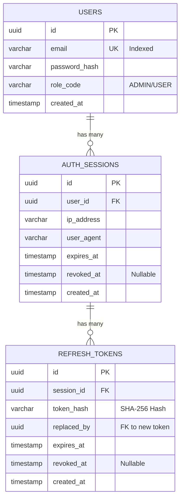
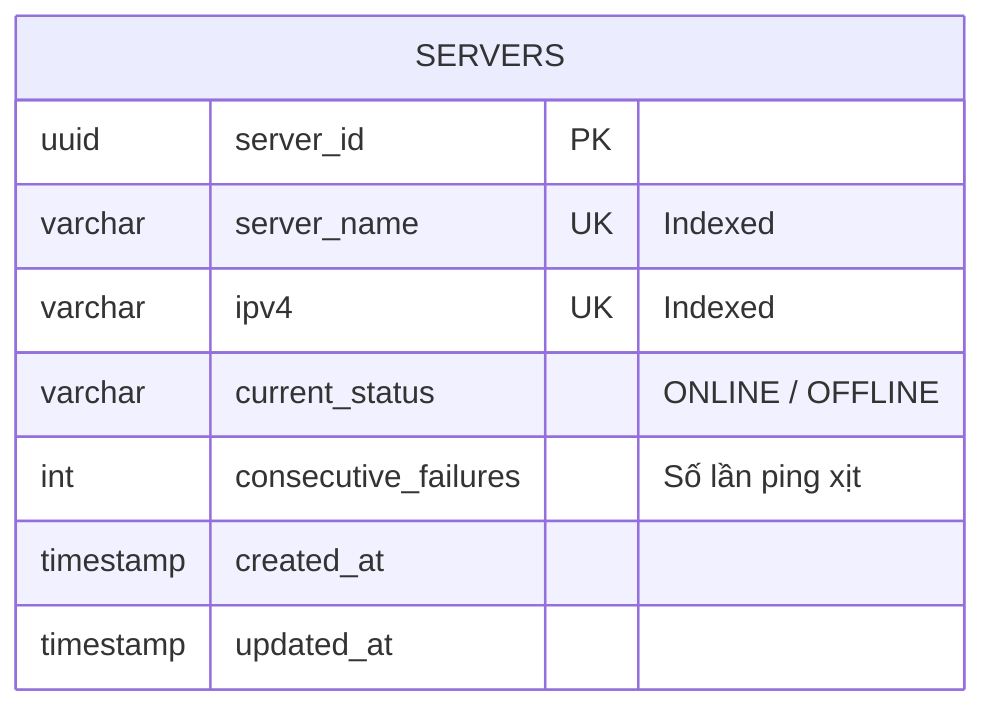
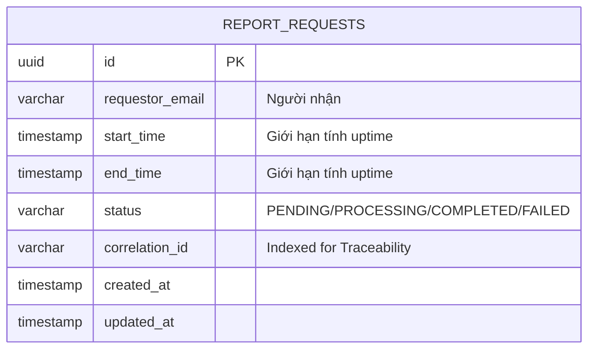

# TÀI LIỆU THIẾT KẾ KIẾN TRÚC
**HỆ THỐNG QUẢN LÝ SERVER (-SMS) - CHƯƠNG TRÌNH ĐÀO TẠO  PASSPORT**

---

## 1. TỔNG QUAN HỆ THỐNG

### 1.1 Mục tiêu hệ thống
Hệ thống Quản lý Server (SMS) là một nền tảng tập trung (Modular Monolith) giúp quản trị viên theo dõi trạng thái hoạt động của hàng nghìn máy chủ theo thời gian thực. Hệ thống cung cấp các tính năng quản lý danh sách server (CRUD, Import/Export Excel), tự động ping giám sát qua giao thức ICMP, tính toán uptime và gửi báo cáo thống kê qua email.

### 1.2 Sơ đồ System Context

*(Ghi chú: Chèn hình ảnh SystemContext.png được export từ giao diện Structurizr http://localhost:9090 vào đây)*

**Chú thích sơ đồ:**
*   **System Administrator (Admin):** Người dùng trực tiếp của hệ thống, thực hiện các thao tác quản trị, import/export server, xem báo cáo thống kê và nhận thông báo cảnh báo qua email.
*   **Server Management System (-SMS):** Hệ thống phần mềm trung tâm, đóng vai trò giám sát, thu thập dữ liệu và báo cáo.
*   **Target Servers (10k+):** Hàng nghìn máy chủ đích nằm trong hạ tầng cần được giám sát. Hệ thống sẽ liên tục gửi gói tin ICMP (Ping) đến các server này để kiểm tra trạng thái sống/chết (ONLINE/OFFLINE).
*   **SMTP Server:** Hệ thống gửi email bên ngoài (như MailHog trong môi trường dev hoặc SendGrid trên production). -SMS giao tiếp với SMTP để gửi báo cáo uptime định kỳ hoặc manual cho Admin.

---

## 2. KIẾN TRÚC TỔNG THỂ 

### 2.1 Container Diagram

*(Ghi chú: Chèn hình ảnh Containers.png từ Structurizr)*

**Chú thích sơ đồ Container:**
Hệ thống được chia thành các Container (tiến trình) độc lập để dễ dàng scale và isolate các tác vụ nặng:
1.  **Web Application (Frontend):** Ứng dụng Single Page Application viết bằng Angular 19. Giao tiếp với Backend qua REST/gRPC.
2.  **Backend Application (API):** Tiến trình core viết bằng Go, phục vụ API. Cung cấp cả gRPC (cho client nội bộ hoặc grpc-web) và REST (qua grpc-gateway).
3.  **Monitoring Worker:** Tiến trình chạy ngầm (Background Worker) viết bằng Go. Tách biệt hoàn toàn khỏi API Server để việc ping hàng nghìn server (ICMP) liên tục mỗi 30 giây không làm ảnh hưởng đến hiệu năng phục vụ API.
4.  **Daily Scheduler:** Tiến trình chạy cron job tự động kích hoạt tiến trình tạo báo cáo vào lúc 00:00 mỗi ngày.
5.  **PostgreSQL (Database):** CSDL quan hệ chính (Single Source of Truth) lưu trữ thông tin User, Session và Metadata của Server.
6.  **Redis (Cache & Lock):** Lưu trữ tạm thời trạng thái (status, retry_count) của server để tối ưu tốc độ đọc (O(1)) cho Monitoring Worker. Đồng thời dùng làm Distributed Lock để tránh đụng độ giữa các Worker.
7.  **Elasticsearch (Log Storage):** CSDL Time-series chuyên dụng lưu trữ từng bản ghi ping (Observation Log). Phục vụ cho việc query Aggregation (tính Uptime) cực nhanh thay vì đếm row trên Postgres.

### 2.2 Chi tiết các khối công nghệ
| Lớp / Phân hệ | Công nghệ | Phiên bản | Vai trò |
| :--- | :--- | :--- | :--- |
| **Backend Core** | Go | 1.22+ | Xử lý logic, hiệu năng cao, goroutine pool |
| **API Protocol** | gRPC + grpc-gateway | v2 | Cung cấp song song gRPC native và REST HTTP |
| **Frontend** | Angular | 19 | Single Page Application (SPA) |
| **Giao diện** | TailwindCSS + NgZorro | 3.x / 19.x | UI Library và Utility-first CSS |
| **Primary DB** | PostgreSQL | 15 | Cơ sở dữ liệu quan hệ (OLTP), GORM làm ORM |
| **Cache & Lock** | Redis | 7 | Server cache, Distributed Lock, Session Revocation |
| **Time-Series DB** | Elasticsearch | 8.17 | Lưu observation logs để query Aggregation uptime |
| **Email** | SMTP / MailHog | - | Dịch vụ gửi email (dev/test) |
| **Ping Library** | pro-bing | 0.8 | ICMP unprivileged/privileged ping |

---

## 3. KIẾN TRÚC CHI TIẾT CÁC NGHIỆP VỤ 

Hệ thống tuân thủ kiến trúc **Modular Monolith** với 4 nghiệp vụ chính. Các component giao tiếp nội bộ qua interface, giảm thiểu sự phụ thuộc trực tiếp.

### 3.1 Nghiệp vụ Quản lý định danh (Identity)

**Mô tả:** Nghiệp vụ này đảm nhiệm việc chứng thực (Authentication) người dùng, cấp phát và quản lý vòng đời của JWT Access Token và Refresh Token. Điểm nổi bật là cơ chế **Anti-Replay Attack**: Nếu phát hiện một Refresh Token đã bị thu hồi (revoked) nhưng vẫn được sử dụng lại, hệ thống sẽ ngay lập tức vô hiệu hóa (LogoutAll) mọi phiên đăng nhập của User đó để bảo vệ tài khoản.

#### 3.1.1 Sơ đồ Component

*(Ghi chú: Chèn hình ảnh Backend Components / Identity từ Structurizr)*

**Chú thích Component:**
*   **Auth Handler:** Xếp ở tầng giao tiếp, tiếp nhận request gRPC/REST từ client, thực hiện validate schema cơ bản.
*   **Auth Service:** Tầng xử lý business logic cốt lõi. So khớp mật khẩu bcrypt, tạo JWT, thực thi logic thu hồi session và rotate refresh token.
*   **Repositories (User/Session/Refresh):** Các interface trừu tượng hóa việc tương tác trực tiếp với PostgreSQL qua GORM.

#### 3.1.2 Các luồng xử lý

*(Ghi chú: Chèn hình ảnh Identity_Refresh dynamic view)*

**Chú thích luồng Refresh Token (Chống Replay Attack):**
1.  Client gửi Refresh Token hiện tại lên API `/refresh`.
2.  Hệ thống hash token bằng thuật toán SHA-256 để tìm kiếm an toàn trong CSDL (`refresh_tokens`).
3.  **Security Check:** Nếu token hash này tồn tại nhưng cột `revoked_at` có giá trị (tức là đã bị sử dụng hoặc thu hồi trước đó), hệ thống kết luận token đã bị đánh cắp và đang bị tái sử dụng (Replay Attack). Ngay lập tức, `Auth Service` gọi Redis để đưa toàn bộ phiên đăng nhập của user này vào danh sách đen (Blacklist), ép user phải đăng nhập lại từ đầu.
4.  Nếu token hợp lệ, hệ thống đánh dấu token cũ là "revoked" và tạo ra một Refresh Token mới (Token Rotation), cùng với Access Token mới trả về cho Client.

#### 3.1.3 Thiết kế Database

**A. ERD (Sơ đồ Thực thể Liên kết)**

**B. Mô tả các Table chi tiết (PostgreSQL)**
*   **Table `users`:** Lưu thông tin cốt lõi của tài khoản. Mật khẩu không lưu plain-text mà lưu dưới dạng `bcrypt`. Email có Unique Constraint để tránh trùng lặp.
*   **Table `auth_sessions`:** Mỗi lần user đăng nhập từ một thiết bị/trình duyệt, một Session (phiên) mới được tạo ra. Lưu lại IP và User-Agent để audit. Nếu user click "Logout", cột `revoked_at` sẽ được set thời gian hiện tại.
*   **Table `refresh_tokens`:** Lưu trữ các mã token dùng để lấy lại Access Token khi hết hạn. Khóa ngoại trỏ đến `auth_sessions`. Không lưu bản rõ của token mà chỉ lưu giá trị `token_hash` (dùng SHA-256) nhằm bảo mật nếu DB bị rò rỉ.

**C. Redis Cache (Session Revocation List)**
*   **Cấu trúc Key:** `revoked_session:{session_id}` (Kiểu STRING).
*   **Mô tả:** Thay vì query vào DB mỗi lần user request để xem session còn hợp lệ không (rất tốn I/O), khi một session bị logout, hệ thống ghi ID của nó vào Redis với thời gian sống (TTL) bằng chính thời gian hết hạn còn lại của JWT token. Middleware chỉ cần check key này trên Redis với tốc độ siêu nhanh.

---

### 3.2 Nghiệp vụ Quản lý Server (Server Management)

**Mô tả:** Cho phép quản trị viên thêm, sửa, xóa, tìm kiếm phân trang và Import/Export máy chủ hàng loạt thông qua file Excel. Nghiệp vụ này ứng dụng chặt chẽ kỹ thuật **Dual-Write** (ghi kép) để đảm bảo đồng bộ hóa trạng thái server giữa PostgreSQL (cho Admin) và Redis (cho Monitoring Worker).

#### 3.2.1 Sơ đồ Component

**Chú thích Component:**
*   **Server Service:** Không chỉ gọi Database, service này còn tích hợp logic parsing file Excel (`excelize`) cực nhanh trên bộ nhớ RAM.
*   **Server Repo:** Nơi xử lý các lệnh SQL phức tạp như Search đa điều kiện, phân trang (LIMIT/OFFSET), và Batch Insert hàng loạt (để tối ưu I/O thay vì insert từng dòng khi import Excel).
*   **Server Cache:** Component trừu tượng hóa tương tác với Redis, đóng vai trò đồng bộ (Dual-Write) trạng thái của Server xuống bộ đệm ngay khi có thay đổi từ Admin.

#### 3.2.2 Các luồng xử lý

**Chú thích luồng Import Server (Excel):**
1.  Admin upload file Excel (Multipart Form).
2.  `Server Service` đọc file Excel trên memory, chia nhỏ dữ liệu thành các lô (Batch) gồm 100 record mỗi lô để xử lý dần, tránh tràn RAM.
3.  Với mỗi lô, hệ thống query DB một lần duy nhất bằng mệnh đề `IN` (`SELECT WHERE ipv4 IN (...)`) để kiểm tra trùng lặp IPv4.
4.  Thực hiện `BatchCreate` (chèn nhiều dòng 1 lúc vào PostgreSQL).
5.  **Dual-Write Pipeline:** Dữ liệu hợp lệ được đồng bộ sang Redis sử dụng **Redis Pipeline**. Bằng cách gộp chung hàng trăm lệnh `HSET` và `SADD` vào chung 1 network roundtrip, hệ thống loại bỏ độ trễ mạng so với gửi từng lệnh rời rạc.

#### 3.2.3 Thiết kế Database

**A. ERD (Sơ đồ Thực thể Liên kết)**

**B. Mô tả Table (PostgreSQL)**
*   **Table `servers`:** Là Single Source of Truth cho danh sách server. Cột `server_name` và `ipv4` đều có Unique Index để đảm bảo tính duy nhất. Cột `current_status` chỉ được cập nhật khi thực sự có thay đổi từ Monitoring Worker (từ ONLINE -> OFFLINE hoặc ngược lại).

**C. Cấu trúc Dual-Write trên Redis (Quan trọng nhất)**
Redis đóng vai trò là "Fast Cache" dành riêng cho Monitoring Worker. PostgreSQL không được thiết kế để chịu được việc Worker đọc toàn bộ danh sách ID mỗi 30s.

*   **Key 1: `server:all_ids` (Kiểu SET)**
    *   **Công dụng:** Lưu tập hợp các UUID của tất cả server đang được quản lý.
    *   **Lý do:** Worker dùng lệnh `SMEMBERS` để bốc toàn bộ UUID ra với độ phức tạp `O(N)` nhanh gọn nhất.
*   **Key 2: `server:info:{id}` (Kiểu HASH)**
    *   **Công dụng:** Lưu thông tin cần thiết để ping: `{ ipv4: "10.0.0.1", status: "ONLINE", retry_count: 0 }`.
    *   **Lý do:** Worker duyệt qua danh sách UUID ở trên, và dùng lệnh `HGET` để bốc IPv4 ra ping, sau đó kiểm tra `status` hiện tại và ghi đè lại bằng `HSET`.

---

### 3.3 Nghiệp vụ Giám sát Server (Monitoring Worker)

**Mô tả:** Tiến trình ngầm, chạy độc lập khỏi API, có vòng lặp (Tick) mặc định là 30 giây một lần. Sử dụng cơ chế Goroutine Pool để thực hiện Ping ICMP đồng thời hàng nghìn servers.

#### 3.3.1 Sơ đồ Component

**Chú thích Component:**
*   **Worker Pool:** Bộ điều phối luồng (Goroutine). Cấp phát 100 worker song song nhận nhiệm vụ ping IP.
*   **ICMP Pinger:** Giao tiếp trực tiếp với OS layer (sử dụng thư viện `pro-bing`). Yêu cầu quyền root (privileged) hoặc network capabilities (`NET_ADMIN`, `NET_RAW`) trên container để chạy ICMP Raw Sockets.
*   **Monitoring Service:** Bộ não đánh giá trạng thái (State Machine). Căn cứ vào số lần ping xịt liên tiếp (Failures Threshold) để quyết định server có bị OFFLINE hay không.
*   **Observation Logger:** Trạm trung chuyển log. Nhận kết quả ping qua Go Channel và lưu xuống Elasticsearch định kỳ từng mảng lớn (Bulk) thay vì lưu lẻ tẻ.

#### 3.3.2 Các luồng xử lý

**Chú thích luồng Ping Cycle (State Machine & Write Reduction):**
1.  **Distributed Lock:** Mở đầu cycle, tiến trình cố gắng set một khóa (`lock:monitoring_worker`) trên Redis với Expire 25 giây. Nếu set thành công, nó trở thành Leader cho cycle này. Nếu thất bại, nghĩa là có instance khác đang chạy, nó sẽ tự động skip để tránh ping trùng lặp.
2.  **Goroutine Dispatching:** Bốc danh sách IPs từ Redis và tống vào một Channel cho 100 worker xử lý đồng thời.
3.  **State Machine (FSM):** 
    *   Nếu ping Fail + đang ONLINE -> Tăng `retryCount` trên Redis.
    *   Nếu `retryCount >= Threshold` (ví dụ 2 lần liên tiếp Fail) -> Đổi status thành OFFLINE. Update Redis + Ghi DB PostgreSQL.
    *   **Tối ưu (Write Amplification Reduction):** Chỉ ghi câu lệnh `UPDATE` vào PostgreSQL khi thực sự có **sự chuyển dịch trạng thái** (từ ONLINE sang OFFLINE hoặc ngược lại). Nếu server vẫn đang duy trì ONLINE dài hạn, Postgres hoàn toàn không phải chịu tải.
4.  **Fire-and-forget Logging:** Bắn kết quả thô `(server_id, is_success, timestamp)` sang Elasticsearch qua Bulk Indexing.

#### 3.3.3 Thiết kế Database / Data Store

**Cấu trúc Document trên Elasticsearch (`sms_observation_logs`)**

Để tính toán uptime chính xác (ví dụ tháng này sống 99.9%), ta không thể lưu ở Postgres vì dữ liệu sẽ phình lên hàng triệu record rất nhanh. Elasticsearch được chọn vì khả năng nén time-series và query Aggregation siêu việt.

| Field | Type | Description |
| :--- | :--- | :--- |
| `server_id` | `keyword` | UUID của server để group by. |
| `is_success`| `boolean` | True = Ping ăn, False = Ping xịt (Timeout/Lost). |
| `timestamp` | `date` | Thời gian ping (UTC). |

---

### 3.4 Nghiệp vụ Báo cáo & Lập lịch (Reporting & Daily Scheduler)

**Mô tả:** Nghiệp vụ xuất báo cáo HTML và gửi qua email. Do việc query hàng triệu log ping trên Elasticsearch mất nhiều giây, tác vụ này được đẩy sang chạy **Async (Bất đồng bộ)** thông qua một Background Worker Pool thứ 2 để không block trải nghiệm trên UI của Admin. `Daily Scheduler` đóng vai trò thay thế Admin tự động ấn nút "Báo cáo" vào mỗi nửa đêm.

#### 3.4.1 Sơ đồ Component

**Chú thích Component:**
*   **Reporting Handler/Service:** Tiếp nhận request, tạo Record PENDING trong DB và ném vào Buffered Channel. Trả về 200 OK ngay lập tức cho client.
*   **Reporting Worker:** Pool gồm 5 worker luôn chạy ngầm, bốc request từ Channel ra xử lý.
*   **ES Uptime Calculator:** Chịu trách nhiệm build JSON Query phức tạp đẩy sang Elasticsearch API.
*   **Notification Service:** Chèn data vào file HTML Template nhúng (embedded html), parse ra HTML string và dùng SMTP gửi đi.

#### 3.4.2 Các luồng xử lý

**Chú thích luồng Background Worker Process:**
1.  Worker bốc một job `ReportRequest` ra khỏi Channel.
2.  Cập nhật trạng thái Job trong PostgreSQL thành `PROCESSING`.
3.  Truy vấn Postgres đếm tổng số server (Total, Online, Offline hiện tại).
4.  Gọi `ES Uptime Calculator`: Query Aggregation đếm tổng số bản ghi log (Total) và tổng bản ghi có `is_success=true`. Uptime = `Success / Total * 100%`.
5.  Render Template và gọi thư viện SMTP chuyển email.
6.  Nếu thành công, cập nhật Postgres thành `COMPLETED`. Nếu có lỗi bất kỳ, cập nhật thành `FAILED`.

#### 3.4.3 Thiết kế Database

**A. ERD (Sơ đồ Thực thể Liên kết)**

**B. Mô tả Table (PostgreSQL)**
*   **Table `report_requests`:** Hoạt động như một bảng Queue/Job tracking. Admin có thể tra cứu lịch sử các báo cáo đã xuất ra, và trạng thái hiện tại của nó. Cột `correlation_id` dùng cho việc tracing log trên hệ thống.
