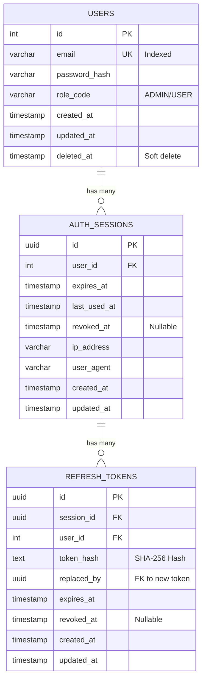
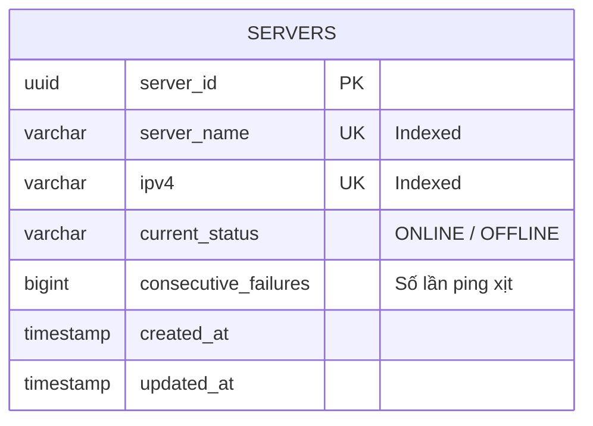
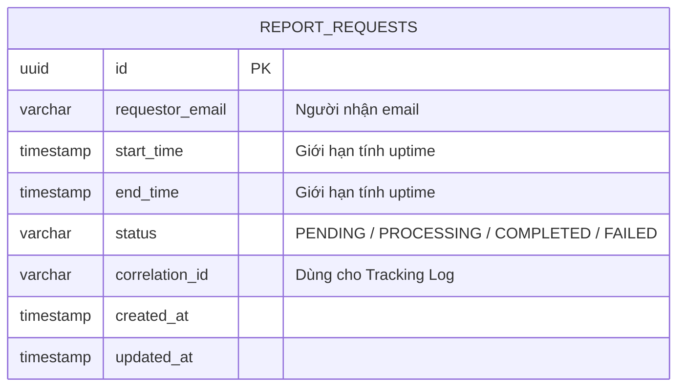
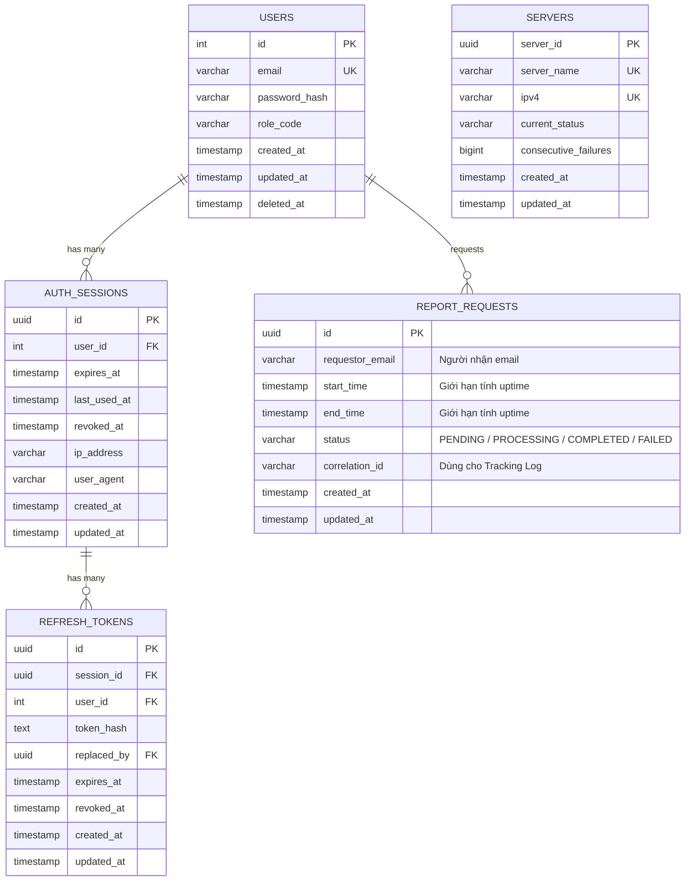

# TÀI LIỆU THIẾT KẾ KIẾN TRÚC
**HỆ THỐNG QUẢN LÝ SERVER (-SMS) - CHƯƠNG TRÌNH ĐÀO TẠO  PASSPORT**

---

## 1. MÔ HÌNH NGỮ CẢNH (SYSTEM CONTEXT - LEVEL 1)

### 1.1 Mục tiêu hệ thống
Hệ thống Quản lý Server (-SMS) là một nền tảng tập trung (Modular Monolith) giúp quản trị viên theo dõi trạng thái hoạt động của hàng nghìn máy chủ theo thời gian thực. Hệ thống cung cấp các tính năng quản lý danh sách server (CRUD, Import/Export Excel), tự động ping giám sát qua giao thức ICMP, tính toán uptime và gửi báo cáo thống kê qua email.

### 1.2 Sơ đồ System Context


*(Ghi chú: Chèn hình ảnh structurizr-SystemContext.png)*

**Chú thích sơ đồ:**
*   **System Administrator (Admin):** Người dùng trực tiếp của hệ thống, thực hiện các thao tác quản trị, import/export server, xem báo cáo thống kê và nhận thông báo cảnh báo qua email.
*   **Server Management System (-SMS):** Hệ thống phần mềm trung tâm, đóng vai trò giám sát, thu thập dữ liệu và báo cáo.
*   **Target Servers (10k+):** Hàng nghìn máy chủ đích nằm trong hạ tầng cần được giám sát. Hệ thống sẽ liên tục gửi gói tin ICMP (Ping) đến các server này để kiểm tra trạng thái sống/chết (ONLINE/OFFLINE).
*   **SMTP Server:** Hệ thống gửi email bên ngoài (như MailHog trong môi trường dev hoặc SendGrid trên production). -SMS giao tiếp với SMTP để gửi báo cáo uptime định kỳ hoặc manual cho Admin.

---

## 2. KIẾN TRÚC TỔNG THỂ (CONTAINER DIAGRAM - LEVEL 2)


*(Ghi chú: Chèn hình ảnh structurizr-Containers.png)*

**Chú thích sơ đồ Container:**
Hệ thống được chia thành các Container (tiến trình) độc lập để dễ dàng scale và isolate các tác vụ nặng:
1.  **Web Application (Frontend):** Ứng dụng Single Page Application viết bằng Angular 19. Giao tiếp với Backend qua REST/gRPC.
2.  **Backend Application (API):** Tiến trình core viết bằng Go, phục vụ API. Cung cấp cả gRPC (cho client nội bộ hoặc grpc-web) và REST (qua grpc-gateway).
3.  **Monitoring Worker:** Tiến trình chạy ngầm (Background Worker) viết bằng Go. Tách biệt hoàn toàn khỏi API Server để việc ping hàng nghìn server (ICMP) liên tục mỗi 30 giây không làm ảnh hưởng đến hiệu năng phục vụ API.
4.  **Daily Scheduler:** Tiến trình chạy cron job tự động kích hoạt tiến trình tạo báo cáo vào lúc 00:00 mỗi ngày.
5.  **PostgreSQL (Database):** CSDL quan hệ chính (Single Source of Truth) lưu trữ thông tin User, Session và Metadata của Server.
6.  **Redis (Cache & Lock):** Lưu trữ tạm thời trạng thái (status, retry_count) của server để tối ưu tốc độ đọc (O(1)) cho Monitoring Worker. Đồng thời dùng làm Distributed Lock để tránh đụng độ giữa các Worker.
7.  **Elasticsearch (Log Storage):** CSDL Time-series chuyên dụng lưu trữ từng bản ghi ping (Observation Log). Phục vụ cho việc query Aggregation (tính Uptime) cực nhanh thay vì đếm row trên Postgres.

### Chi tiết các khối công nghệ
| Lớp / Phân hệ | Công nghệ | Phiên bản | Vai trò |
| :--- | :--- | :--- | :--- |
| **Backend Core** | Go | 1.22+ | Xử lý logic, hiệu năng cao, goroutine pool |
| **API Protocol** | gRPC + grpc-gateway | v2 | Cung cấp song song gRPC native và REST HTTP |
| **Frontend** | Angular | 19 | Single Page Application (SPA) |
| **Primary DB** | PostgreSQL | 15 | Cơ sở dữ liệu quan hệ (OLTP), GORM làm ORM |
| **Cache & Lock** | Redis | 7 | Server cache, Distributed Lock, Session Revocation |
| **Time-Series DB** | Elasticsearch | 8.17 | Lưu observation logs để query Aggregation uptime |

---

## 3. KIẾN TRÚC THÀNH PHẦN (COMPONENT DIAGRAMS - LEVEL 3)

Hệ thống tuân thủ kiến trúc **Modular Monolith**. Các tiến trình (Container) ở Backend được bóc tách chi tiết thành các Component như sau:

### 3.1 Các Component của Backend Application (API Server)

*(Ghi chú: Chèn hình ảnh structurizr-Backend_Components.png)*

API Server bao gồm 3 module nghiệp vụ chính (Identity, Server Management, Reporting) và 1 module phụ trợ (Notification). **Quyết định kiến trúc:** Áp dụng mô hình Layered Architecture (Handler -> Service -> Repository) kết hợp Dependency Injection. Các component giao tiếp lỏng lẻo (Loose Coupling) thông qua Interface nội bộ, giúp hệ thống cực kỳ dễ dàng viết Unit Test (Mocking) và mở rộng tính năng.

### 3.2 Các Component của Monitoring Worker

*(Ghi chú: Chèn hình ảnh structurizr-MonitorWorker_Components.png)*

Được thiết kế theo mô hình **Goroutine Worker Pool** kết hợp thư viện `pro-bing`. Hệ thống giới hạn số lượng luồng đồng thời (Concurrency Limit) thay vì spawn vô hạn goroutine, ngăn chặn tình trạng tràn RAM và sập nghẽn mạng (Network Congestion). Tối ưu hóa I/O bằng State Machine nội bộ (FSM) và Bulk Insert.

### 3.3 Các Component của Daily Scheduler

*(Ghi chú: Chèn hình ảnh structurizr-Scheduler_Components.png)*

Tiến trình in-memory nhỏ gọn, sử dụng Cronjob để tự động mồi (trigger) request Báo cáo. **Quyết định kiến trúc:** Việc bóc tách Scheduler thành một tiến trình độc lập hoàn toàn khỏi API Server giúp đảm bảo tính chịu lỗi (Fault Tolerance). Khi API Server cần restart hoặc scale up/down, các lịch trình hẹn giờ không hề bị gián đoạn hay chạy trùng lặp.

---

## 4. LUỒNG XỬ LÝ CHI TIẾT & DATABASE (DYNAMIC VIEWS - LEVEL 4)

Phần này đi sâu vào Sequence Diagram (Sơ đồ tuần tự) của từng luồng nghiệp vụ cụ thể và thiết kế Schema tương ứng.

### 4.1 Nghiệp vụ Quản lý định danh (Identity)

**Mô tả:** Đảm nhiệm việc chứng thực, cấp phát JWT, và quản lý Refresh Token với cơ chế **Anti-Replay Attack**.

#### 4.1.1 Các luồng xử lý (Sequence Diagrams)

**A. Luồng Đăng nhập (Login)**


**B. Luồng Xác thực Token (Verify Token Middleware)**

*Middleware luôn check token có bị Revoked trong Redis hay không trước khi cho phép request đi tiếp.*

**C. Luồng Refresh Token (Cơ chế chống Replay Attack)**

*Nếu phát hiện một Token đã hết hạn/bị thu hồi nhưng vẫn cố tình dùng lại, hệ thống sẽ Logout All mọi phiên của user đó.*

**D. Luồng Đăng xuất (Logout)**


#### 4.1.2 Thiết kế Database (Identity)

**Sơ đồ ERD (Identity)**

    
    AUTH_SESSIONS {
        uuid id PK
        uuid user_id FK
        timestamp expires_at
        timestamp revoked_at "Nullable"
    }

    REFRESH_TOKENS {
        uuid id PK
        uuid session_id FK
        text token_hash "SHA-256 Hash"
        uuid replaced_by "FK to new token"
        timestamp revoked_at "Nullable"
    }
```

**Từ điển Dữ liệu (Data Dictionary)**

*Bảng `USERS`*
| Column | Type | Constraints | Description |
| :--- | :--- | :--- | :--- |
| `id` | INT/UINT | PK | Khóa chính tự tăng (gorm.Model) |
| `email` | VARCHAR | UK, Indexed | Dùng để đăng nhập |
| `password_hash` | VARCHAR | | Mật khẩu băm (Bcrypt) |
| `role_code` | VARCHAR | | Phân quyền (VD: ADMIN) |
| `created_at / updated_at` | TIMESTAMP | | Dấu thời gian tạo/cập nhật |
| `deleted_at` | TIMESTAMP | Indexed | Dùng cho cơ chế Soft Delete |

*Bảng `AUTH_SESSIONS`*
| Column | Type | Constraints | Description |
| :--- | :--- | :--- | :--- |
| `id` | UUID | PK | Khóa chính Session |
| `user_id`| INT/UINT | FK, Indexed | Khóa ngoại trỏ về USERS |
| `expires_at` | TIMESTAMP | | Thời điểm hết hạn |
| `last_used_at` | TIMESTAMP | | Thời điểm Session được dùng gần nhất |
| `revoked_at` | TIMESTAMP | Nullable | Thời điểm bị admin thu hồi. Nếu NULL là còn hiệu lực. |
| `ip_address` | VARCHAR | | IP của thiết bị đăng nhập |
| `user_agent` | VARCHAR | | Thông tin trình duyệt/app |
| `created_at / updated_at` | TIMESTAMP | | Dấu thời gian hệ thống |

*Bảng `REFRESH_TOKENS`*
| Column | Type | Constraints | Description |
| :--- | :--- | :--- | :--- |
| `id` | UUID | PK | Khóa chính Token |
| `session_id`| UUID | FK, Indexed | Khóa ngoại trỏ về AUTH_SESSIONS |
| `user_id`| INT/UINT | FK, Indexed | Khóa ngoại denormalized trỏ về USERS |
| `token_hash`| TEXT | UK, Indexed | Chuỗi hash SHA-256 của Refresh Token |
| `expires_at` | TIMESTAMP | | Thời điểm hết hạn |
| `revoked_at` | TIMESTAMP | Nullable | Thời điểm bị admin thu hồi |
| `replaced_by` | UUID | FK, Nullable | Cơ chế xoay vòng: Trỏ về ID của token mới |
| `created_at / updated_at` | TIMESTAMP | | Dấu thời gian hệ thống |

**Redis Cache (Identity)**
| Key Pattern | Data Type | TTL | Purpose |
| :--- | :--- | :--- | :--- |
| `revoked_session:{id}` | STRING | Theo thời hạn Token | Chặn session bị thu hồi, Anti-Replay Attack. |

---

### 4.2 Nghiệp vụ Quản lý Server (Server Management)

**Mô tả:** Cung cấp API CRUD và Import/Export Excel. Ứng dụng kỹ thuật **Dual-Write** xuống cả PostgreSQL và Redis để Monitoring Worker có thể lấy dữ liệu cực nhanh.

#### 4.2.1 Các luồng xử lý (Sequence Diagrams)

**A. Luồng Tìm kiếm & Phân trang (List Servers)**


**B. Luồng Tạo mới (Create Server)**


**C. Luồng Cập nhật & Xóa (Update / Delete)**


*Lưu ý: Mọi thao tác Create/Update/Delete đều được ghi đè (Dual-write) sang Redis.*
**D. Luồng Import Excel Hàng loạt (Import)**

*Tối ưu I/O bằng cách dùng Batch Insert trên Postgres và Redis Pipeline.*

**E. Luồng Export Excel (Export)**

*Xử lý đồng bộ (Synchronous) ngay trên luồng HTTP Request. Tối ưu hóa bộ nhớ (RAM) bằng kỹ thuật StreamWriter của thư viện `excelize`, cho phép ghi dữ liệu dạng luồng (Stream) trực tiếp xuống Buffer thay vì load toàn bộ dữ liệu vào bộ nhớ.*

#### 4.2.2 Thiết kế Database (Server Management)

**Sơ đồ ERD (Server Management)**



**Từ điển Dữ liệu (Data Dictionary)**

*Bảng `SERVERS`*
| Column | Type | Constraints | Description |
| :--- | :--- | :--- | :--- |
| `server_id` | UUID | PK | Khóa chính định danh server |
| `server_name` | VARCHAR | UK, Indexed | Tên hiển thị của server |
| `ipv4` | VARCHAR(15)| UK, Indexed | Bắt buộc đúng định dạng IPv4 |
| `current_status` | VARCHAR | | ONLINE hoặc OFFLINE |
| `consecutive_failures`| BIGINT | | Số lần ping xịt liên tiếp |
| `created_at / updated_at` | TIMESTAMP | | Dấu thời gian hệ thống |

**Redis Dual-Write (Server Management)**
| Key Pattern | Data Type | TTL | Purpose |
| :--- | :--- | :--- | :--- |
| `server:all_ids` | SET | Vô hạn | Lưu toàn bộ UUID để Worker dùng lệnh `SMEMBERS` kéo về RAM siêu tốc. |
| `server:info:{id}` | HASH | Vô hạn | Lưu `{ ipv4, status, retry_count }`. Dùng `HGET` lấy thông tin ngay lập tức. |

---

### 4.3 Nghiệp vụ Giám sát Server (Monitoring Worker)

**Mô tả & Quyết định kiến trúc:** Tiến trình ngầm phân tán, tự động kích hoạt mỗi 30s. Áp dụng mô hình **Goroutine Worker Pool**: Hàng nghìn tác vụ Ping (Job) được đẩy vào một Buffered Channel. Một lượng Worker cố định sẽ liên tục consume tác vụ từ Channel này. Thiết kế này khai thác tối đa sức mạnh đa luồng của Golang (Concurrency) nhưng vẫn kiểm soát chặt chẽ tài nguyên phần cứng (CPU/RAM/Network), tránh hiện tượng thắt cổ chai.

#### 4.3.1 Các luồng xử lý (Sequence Diagrams)

**A. Luồng Ping ICMP (Ping Cycle)**

*Áp dụng thuật toán Write Amplification Reduction: Chỉ update DB Postgres khi server thực sự chuyển trạng thái. Elasticsearch lưu toàn bộ log qua Bulk API.*

#### 4.3.2 Thiết kế Caching & Lock (Redis)

**Redis Distributed Lock (Monitoring)**
| Key Pattern | Data Type | TTL | Purpose |
| :--- | :--- | :--- | :--- |
| `lock:monitoring_worker` | STRING (NX) | 25s | Distributed Lock (Mutex) ngăn chặn việc nhiều tiến trình Monitoring Worker chạy song song gây trùng lặp lịch ping (được cấu hình bằng biến môi trường `MONITORING_WORKER_LOCK_KEY`). |

#### 4.3.3 Thiết kế Data Store (Elasticsearch)

Hàng chục nghìn gói tin ping mỗi phút sẽ làm phình to CSDL quan hệ. Vì vậy toàn bộ Observation Logs được đẩy sang Elasticsearch bằng Bulk API.

**Index: `sms_observation_logs`**

| Field | JSON Type | ES Mapping Type | Purpose |
| :--- | :--- | :--- | :--- |
| `server_id` | String | `keyword` | Bắt buộc là `keyword` để có thể chạy Aggregation Group-by khi tính tỷ lệ Uptime. |
| `is_success` | Boolean | `boolean` | Dùng để filter số lần ping thành công / thất bại. |
| `timestamp` | String | `date` | Phục vụ truy vấn khoảng thời gian (Range query) để xuất báo cáo theo tháng/quý. |

```json
{
  "mappings": {
    "properties": {
      "server_id": { "type": "keyword" },
      "is_success": { "type": "boolean" },
      "timestamp": { "type": "date" }
    }
  }
}
```

---

### 4.4 Nghiệp vụ Báo cáo & Cảnh báo (Reporting & Notification)

**Mô tả & Quyết định kiến trúc:** Chuyển giao toàn bộ tác vụ nặng (tính toán Uptime trên Elasticsearch, render HTML, gọi SMTP) sang **Background Worker Process**. API Handler chỉ việc đẩy Job vào Buffered Channel và trả về 200 OK ngay lập tức (Non-blocking I/O). Thiết kế này giúp API Server giữ được Throughput cao và chịu tải tốt dưới áp lực lớn.

#### 4.4.1 Các luồng xử lý (Sequence Diagrams)

**A. Luồng Admin yêu cầu tạo báo cáo (Manual Request)**

*Request trả về 200 OK ngay lập tức, việc nặng được nhét vào Queue (Channel).*

**B. Luồng Lập lịch tự động (Scheduled Request)**


**C. Luồng Xử lý ngầm & Gửi Email (Background Worker Process)**

*Worker bốc Job ra tính toán Uptime dựa trên Elasticsearch Aggregation, render HTML và gọi Notification Module để bắn email.*

#### 4.4.2 Thiết kế Database (Reporting)

**Sơ đồ ERD (Reporting)**


**Từ điển Dữ liệu (Data Dictionary)**

*Bảng `REPORT_REQUESTS`*
| Column | Type | Constraints | Description |
| :--- | :--- | :--- | :--- |
| `id` | UUID | PK | Khóa chính |
| `status` | VARCHAR | | PENDING / PROCESSING / COMPLETED / FAILED |
| `correlation_id` | VARCHAR | Indexed | Dùng để tra cứu log trên ELK |
| `created_at / updated_at` | TIMESTAMP | | Dấu thời gian hệ thống |


---

## 5. TỔNG QUAN KIẾN TRÚC LƯU TRỮ (GLOBAL DATA ARCHITECTURE)

Hệ thống Quản lý Server (-SMS) được thiết kế theo tư duy **Polyglot Persistence** (Đa mô hình lưu trữ), trong đó mỗi công nghệ lưu trữ được lựa chọn kỹ lưỡng để giải quyết một bài toán đặc thù, thay vì nhồi nhét tất cả vào một cơ sở dữ liệu duy nhất.

### 5.1. Chiến lược lưu trữ đa mô hình (Polyglot Persistence Strategy)

*   **PostgreSQL (Relational - OLTP):** Đóng vai trò *Single Source of Truth* cho toàn hệ thống. Đảm bảo tính toàn vẹn (ACID) cho dữ liệu định danh (Users/Sessions) và Metadata của Servers. Cơ sở dữ liệu này được thiết kế chuẩn hóa cao, phân chia theo Schema (Bounded Context).
*   **Redis (In-memory - Key/Value):** Đóng vai trò tối ưu hóa ranh giới tốc độ và tranh chấp tài nguyên:
    *   *Identity:* Chặn Anti-Replay Attack bằng cách lưu trữ tạm thời các Token vừa bị thu hồi.
    *   *Server Management:* Cache tốc độ cao toàn bộ trạng thái Server (Status, IPv4, Failures) với thời gian truy xuất O(1).
    *   *Monitoring:* Hoạt động như một Distributed Lock (Mutex) để đảm bảo tiến trình chạy nền không bị giẫm chân lên nhau.
*   **Elasticsearch (Time-Series / Search Engine):** Xử lý bài toán phình to dữ liệu (Data Growth). Việc tách hoàn toàn hàng chục triệu bản ghi Log Ping (Observation Logs) ra khỏi DB quan hệ giúp hệ thống tối ưu hóa cực đỉnh năng lực truy vấn gom nhóm (Aggregation) khi cần tính toán tỷ lệ Uptime.

### 5.2. Sơ đồ dữ liệu quan hệ tổng thể (Global ERD - PostgreSQL)

Dưới đây là bức tranh toàn cảnh kết nối tất cả các bảng quan hệ trong hệ thống để cung cấp góc nhìn tổng thể cho DBA (Chi tiết Data Dictionary xem tại các mục 4.x tương ứng).



### 5.3. Chiến lược đồng bộ & Luân chuyển dữ liệu (Data Flow & Synchronization)

Để ba hệ thống cơ sở dữ liệu trên luôn hoạt động nhất quán, Kiến trúc sư thiết lập các luồng đồng bộ sau:
1.  **Cơ chế Dual-write (Postgres + Redis):** Mỗi khi có thao tác Create/Update/Delete Server trên PostgreSQL, hệ thống thực thi một Transaction hoặc Pipeline lập tức ghi đè thông tin tương ứng sang Redis Cache. Đảm bảo Monitoring Worker luôn đọc được dữ liệu mới nhất.
2.  **Cơ chế Write Amplification Reduction (Postgres):** Tiến trình Monitoring chỉ cập nhật DB Postgres khi và chỉ khi server **thực sự chuyển trạng thái** (Từ ONLINE sang OFFLINE hoặc ngược lại), thay vì update DB liên tục mỗi lần ping.
3.  **Cơ chế Asynchronous Logging (Elasticsearch):** Monitoring Worker không ghi trực tiếp log ping vào DB. Thay vào đó, dữ liệu được đẩy vào một Buffered Channel (Goroutine), sau đó Bulk Insert lên Elasticsearch theo từng Batch (chu kỳ vài giây). Kiến trúc Fire-and-forget này giúp luồng Ping ICMP cực kỳ thanh thoát và không bị thắt cổ chai bởi I/O mạng.

---

## 6. BẢO MẬT & GIỚI HẠN TÀI NGUYÊN (SECURITY & RATE LIMITING)

Hệ thống được thiết kế với cơ chế phòng thủ nhiều lớp thông qua chuỗi **gRPC Interceptors** và Middleware, đặc biệt là cơ chế Rate Limiting nghiêm ngặt để chống lại các cuộc tấn công DDoS và Brute-force:

### 6.1. Rate Limiting (Giới hạn truy cập)
Sử dụng **Redis** làm kho lưu trữ biến đếm phân tán (Distributed Counters). Giới hạn được bóc tách thành 2 cấp độ:

*   **Pre-Auth Rate Limit (Theo IP):** Chặn các request nặc danh quá đà trước cả khi hệ thống tốn CPU để parse Token.
    *   **Login:** 5 requests / phút (Ngăn chặn dò mật khẩu).
    *   **Refresh Token:** 30 requests / phút.
*   **Post-Auth Rate Limit (Theo UserID):** Phân bổ tài nguyên hợp lý giữa các User đã đăng nhập.
    *   **Import Server / Upload:** 5 requests / phút (Do file Excel ngốn nhiều RAM).
    *   **Request Report:** 10 requests / phút.
    *   **Delete Server:** 20 requests / phút (Ngăn chặn hành vi phá hoại).
    *   **Create / Update Server:** 60 requests / phút.
    *   **View Servers (Read):** 120 requests / phút.
    *   **Global (Mặc định cho các API khác):** 300 requests / phút.

### 6.2. Các lớp bảo vệ khác
*   **Authentication (JWT):** Yêu cầu Token hợp lệ kèm cơ chế Anti-Replay Attack bằng Token Blacklist (Redis).
*   **CSRF Protection:** Chặn các cuộc tấn công giả mạo yêu cầu qua trình duyệt.
*   **RBAC (Role-Based Access Control):** Phân quyền dựa trên User Role (Admin, Editor, Viewer).
