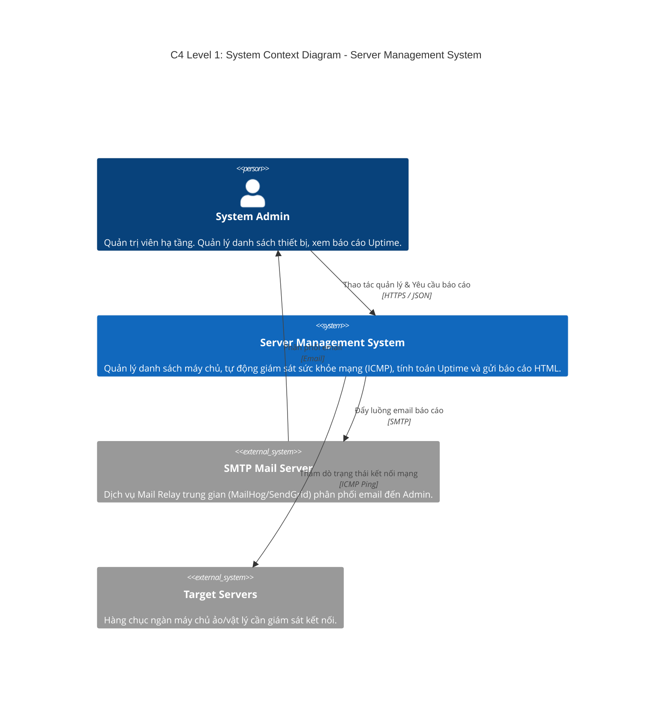
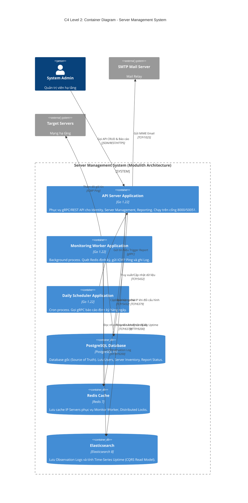
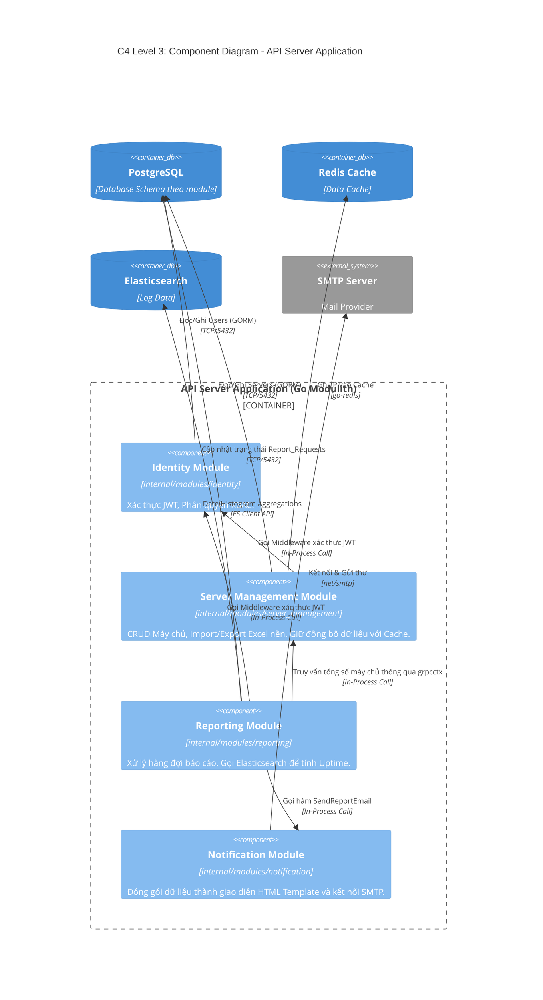

# THIẾT KẾ KIẾN TRÚC HỆ THỐNG (C4 MODEL)

Tài liệu mô tả kiến trúc Quản lý Server (SMS) theo phương pháp C4. Các biểu đồ mô tả ranh giới hệ thống, ứng dụng, và giao tiếp nội bộ trong kiến trúc Modular Monolith.

## 1. Level 1: System Context Diagram

Xác định ranh giới ngoài của hệ thống SMS, các diễn viên (Actors) thao tác với hệ thống và các hệ thống phụ trợ bên ngoài.

## 2. Level 2: Container Diagram

Bóc tách các khối tiến trình thực thi độc lập (Containers) và hạ tầng lưu trữ bên trong Server Management System.

## 3. Level 3: Component Diagram

Chi tiết hóa `API Server Application`, làm rõ các ranh giới module chức năng nội bộ (Identity, Server Management, Reporting) theo phong cách Modular Monolith. Cấm tuyệt đối truy xuất DB chéo module.

## 4. Bổ sung: Database Schema Boundaries

Sử dụng nguyên lý chia tách logic (Logical Schema Isolation) cho Database để giữ ranh giới sạch giữa các module. Các bảng không kết nối khóa ngoại (Foreign Key) cứng qua lại giữa các domain.

| Tên Module | Schema / Table Name | Khóa chính (PK) | Chức năng lưu trữ |
|---|---|---|---|
| **Identity** | `public.users` | `id` | Thông tin đăng nhập Admin, Role. |
| **Server Mgmt** | `management_schema.servers` | `server_id` | Cấu hình máy chủ cốt lõi (Tên, IPv4, Status). |
| **Reporting** | `reporting_schema.report_requests` | `id` | Hàng đợi yêu cầu kết xuất báo cáo (Pending/Done). |
| **Monitoring** | *(Lưu Log tại Elasticsearch)* | `_id` | Document-DB chứa Time-Series Log trạng thái mạng. |
