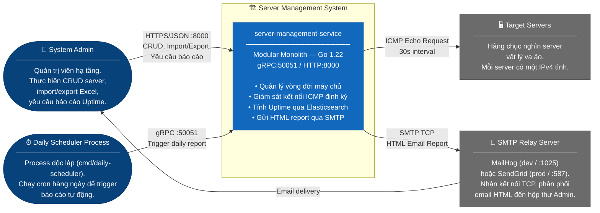
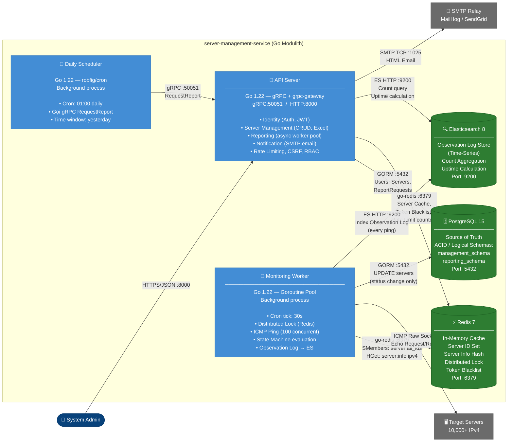
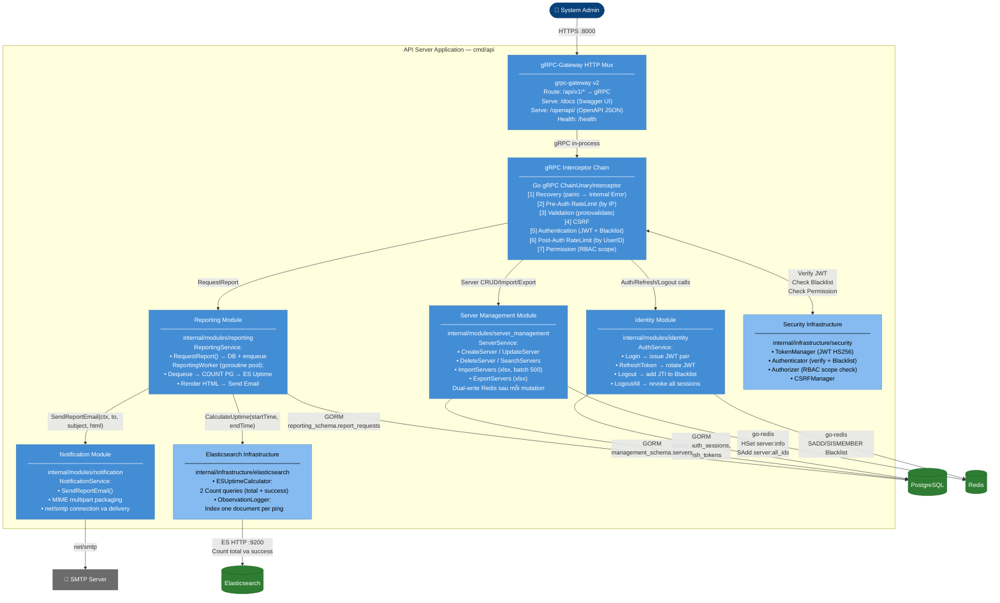
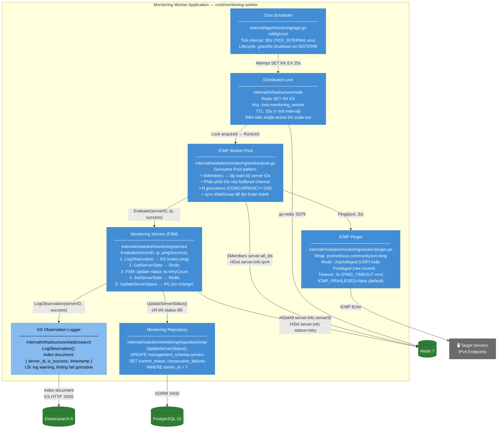
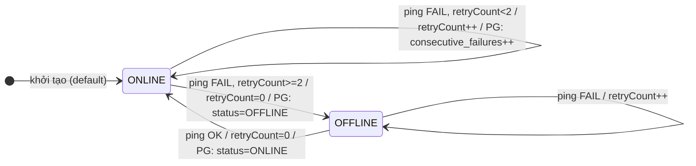
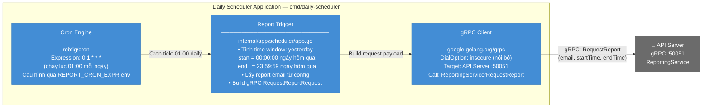

# THIẾT KẾ KIẾN TRÚC HỆ THỐNG THEO C4 MODEL

## Server Management System (SMS) — `server-management-service`

> **Trạng thái:** Phiên bản chính thức (Official) — Phản ánh source code tại nhánh `unit-test`.
> **Phương pháp:** C4 Model (Simon Brown) — Level 1 đến Level 4.
> **Cú pháp sơ đồ:** Mermaid.js native (`flowchart`, `stateDiagram-v2`).

---

## 1. Tổng Quan

### 1.1 Mục Đích Tài Liệu

Tài liệu mô tả kiến trúc `server-management-service` qua 4 tầng phóng to dần (Zoom-in):
- **Level 1 (Context):** Hệ thống tương tác với ai và với hệ thống nào bên ngoài.
- **Level 2 (Container):** Các tiến trình thực thi và kho lưu trữ nội bộ.
- **Level 3 (Component):** Cấu trúc nội bộ của từng container.
- **Level 4 (Code/Data):** Schema, Redis keys, Elasticsearch mapping.

### 1.2 Tóm Tắt Hệ Thống

| Thuộc tính | Giá trị |
|---|---|
| **Tên service** | `server-management-service` |
| **Ngôn ngữ** | Go 1.22 |
| **Kiến trúc** | Modular Monolith (Modulith) |
| **Giao thức** | gRPC (:50051) + HTTP/REST via grpc-gateway (:8000) |
| **Database chính** | PostgreSQL 15 |
| **Cache** | Redis 7 |
| **Analytics Store** | Elasticsearch 8 |
| **Email** | SMTP (MailHog :1025 dev / SendGrid :587 prod) |
| **Entry points** | 3 binary độc lập: `cmd/api`, `cmd/monitoring-worker`, `cmd/daily-scheduler` |

---

## 2. Level 1 – System Context Diagram

Xác định ranh giới ngoài của hệ thống SMS: ai tương tác với nó và hệ thống ngoại vi nào được sử dụng.

### 2.1 Biểu Đồ



### 2.2 Bảng Actor và External Systems

| Đối tượng | Loại | Giao thức | Mô tả tương tác |
|---|---|---|---|
| **System Admin** | Human Actor | HTTPS:8000 | Dùng Swagger UI (`/docs`) hoặc REST client. JWT lưu trong HttpOnly Cookie, tự động đính kèm theo mọi request sau Login. |
| **Daily Scheduler Process** | Automated Process | gRPC:50051 | Process độc lập (`cmd/daily-scheduler`). Cron hàng ngày (01:00). Gọi gRPC `RequestReport` sang API Server với time window của ngày hôm trước. |
| **Target Servers** | External System | ICMP | Không chủ động gửi request. Chỉ phản hồi ICMP Ping. Nếu Firewall chặn ICMP, server bị đánh dấu OFFLINE (false positive — cần whitelist IP của SMS). |
| **SMTP Relay** | External System | SMTP TCP | Nhận kết nối từ `NotificationService`. Lỗi kết nối SMTP được log và report job chuyển sang `FAILED`. |

### 2.3 Ba Luồng Dữ Liệu Chính

1. **Admin → SMS → DB**: Admin gọi API → gRPC Interceptor Chain xử lý → ghi PostgreSQL → đồng bộ Redis cache.
2. **SMS → Target Servers → SMS**: Monitoring cron tick 30s → Worker Pool đọc IP từ Redis → ICMP Ping song song → State Machine đánh giá → ghi Observation Log vào Elasticsearch (mỗi lần ping) → update PostgreSQL (chỉ khi status đổi).
3. **SMS → SMTP → Admin**: Report Worker tính Uptime từ Elasticsearch Count query → render HTML template → SMTP gửi email.

---

## 3. Level 2 – Container Diagram

Phân rã `server-management-service` thành các container thực thi và kho lưu trữ.

### 3.1 Biểu Đồ



### 3.2 Bảng Container

| Container | Technology | Port | Trách nhiệm | Entry Point |
|---|---|---|---|---|
| **API Server** | Go, gRPC, grpc-gateway v2 | gRPC:50051, HTTP:8000 | Identity, Server CRUD, Import/Export Excel, Reporting Worker Pool, Notification, Rate Limit, RBAC | `cmd/api/main.go` |
| **Monitoring Worker** | Go, Goroutine Pool, pro-bing | — | ICMP Ping 30s cycle, State Machine, Observation Log → ES | `cmd/monitoring-worker/main.go` |
| **Daily Scheduler** | Go, robfig/cron | — | Cron hàng ngày, gọi gRPC `RequestReport` sang API Server | `cmd/daily-scheduler/main.go` |
| **PostgreSQL 15** | PostgreSQL | 5432 | Source of Truth, ACID, Logical Schema Isolation | `docker-compose.yml` |
| **Redis 7** | Redis | 6379 | Server cache, Distributed Lock, Token Blacklist, Rate Limit | `docker-compose.yml` |
| **Elasticsearch 8** | Elasticsearch | 9200 | Time-series Observation Logs, Uptime Count Aggregation | `docker-compose.yml` |

### 3.3 Luồng Giao Tiếp Chi Tiết

**Luồng 1 — Create Server:**

```text
Admin → POST /api/v1/servers
  → [Interceptor Chain: Validate → Auth → Permission:server:create]
  → ServerManagementServer.CreateServer()
    → serverService.CreateServer()
      → repo.GetByName()                      [duplicate check]
      → repo.GetByIPv4()                      [duplicate check]
      → repo.Create()                         [INSERT management_schema.servers]
      → cache.Upsert(id, ipv4, "ONLINE", 0)  [HSet server:info + SAdd server:all_ids]
  ← HTTP 200 OK + Server JSON
```

**Luồng 2 — Monitoring Cycle (30s, không có Admin trigger):**

```text
Cron tick (30s)
  → Acquire Redis Distributed Lock (SET NX EX 25s)
  → workerPool.Run(ctx)
      → SMembers("server:all_ids")            [~<5ms, toàn bộ ID]
      → Distribute IDs vào buffered channel
      → 100 Goroutines song song:
          → HGet("server:info:<id>", "ipv4")
          → ICMP Ping(ipv4, timeout=3s)
          → monitoringService.Evaluate(serverID, ip, pingSuccess)
              → esLogger.LogObservation()     [ES: index mỗi lần ping]
              → stateStore.GetServerState()   [Redis HGetAll "server:info:<id>"]
              → FSM evaluation
              → stateStore.SetServerState()   [Redis HSet status + retry_count]
              → [nếu status đổi]
                  → repo.UpdateServerStatus() [PostgreSQL UPDATE]
  → Release Lock
```

**Luồng 3 — Request Report (Async):**

```text
Admin → POST /api/v1/reports
  → [Interceptor Chain: Auth → Permission:report:request]
  → ReportingGrpcHandler.RequestReport()
    → reportingService.RequestReport()
      → repo.CreateReportRequest()            [INSERT reporting_schema.report_requests, status=PENDING]
      → worker.EnqueueReport(req)             [push vào buffered channel]
  ← HTTP 200 OK { "status": "processing" }

[Async trong Reporting Worker Goroutine Pool]
  → repo.UpdateReportStatus(PROCESSING)
  → repo.GetServerCountByStatus("", "ONLINE", "OFFLINE")  [3 COUNT queries → PG]
  → esUptimeCalc.CalculateUptime(startTime, endTime)       [2 Count queries → ES]
  → html/template.Execute(statusReportTemplate, data)
  → notificationService.SendReportEmail(to, subject, html)
      → smtp.Send()
  → repo.UpdateReportStatus(COMPLETED | FAILED)
```

---

## 4. Level 3 – Component Diagram: API Server Application

### 4.1 Biểu Đồ



### 4.2 Bảng Component

| Component | Package Path | Technology | Trách nhiệm chính |
|---|---|---|---|
| **gRPC-Gateway HTTP Mux** | `internal/app/run.go` | grpc-gateway v2 | Route HTTP/JSON → gRPC, serve `/docs` va `/openapi/` |
| **gRPC Interceptor Chain** | `internal/app/grpc_server.go`, `internal/shared/middlewares/` | Go gRPC ChainUnaryInterceptor | 7 tầng middleware theo thứ tự cố định |
| **Identity Module** | `internal/modules/identity/` | Go, GORM, JWT HS256 | Auth lifecycle: Login, RefreshToken, Logout |
| **Server Management Module** | `internal/modules/server_management/` | Go, GORM, excelize | CRUD + Import/Export Excel, Dual-write Redis |
| **Reporting Module** | `internal/modules/reporting/` | Go, Goroutine Pool, html/template | Async report generation (embedded template) |
| **Notification Module** | `internal/modules/notification/` | Go, net/smtp | MIME email packaging va delivery |
| **Security Infrastructure** | `internal/infrastructure/security/` | Go, golang-jwt/jwt | JWT, RBAC, CSRF — dùng chung bởi Interceptor Chain |
| **Elasticsearch Infrastructure** | `internal/infrastructure/elasticsearch/` | Go, go-elasticsearch/v8 | Uptime Count Aggregation + Observation logging |

### 4.3 Chi Tiết Interceptor Chain

Mọi gRPC call (kể cả từ grpc-gateway) đều đi qua chuỗi sau **theo đúng thứ tự**:

```text
Request in
  │
  ▼
[1] RecoveryInterceptor
    → Recover khỏi panic trong handler, trả codes.Internal
  │
  ▼
[2] PreAuthRateLimitInterceptor
    → Rate limit theo IP (trước khi biết UserID)
    → Login: 5 requests/phút. Refresh Token: 30 requests/phút.
    → Backend: Redis counter per IP+method
  │
  ▼
[3] ValidationInterceptor
    → Validate protobuf message bằng buf.build/go/protovalidate
    → Fail-fast nếu field vi phạm constraint
  │
  ▼
[4] CSRFInterceptor
    → Kiểm tra CSRF token cho state-changing methods
  │
  ▼
[5] AuthenticationInterceptor
    → Bỏ qua (skip) nếu là Public Method (xem bên dưới)
    → Còn lại: Extract JWT từ HttpOnly Cookie
               Verify JWT signature (HS256)
               Kiểm tra JTI trong Redis Blacklist (chống token bị thu hồi)
  │
  ▼
[6] PostAuthRateLimitInterceptor
    → Rate limit theo UserID (chính xác hơn Pre-Auth)
    → Backend: Redis counter per UserID+method
  │
  ▼
[7] PermissionInterceptor
    → Lookup gRPC method path trong Permission Map
    → Kiểm tra RoleCode trong JWT claims
    → Trả codes.PermissionDenied nếu không đủ quyền
  │
  ▼
Handler (Identity / Server Management / Reporting)
```

**Public Methods** — bypass Authentication, PostAuth RateLimit, Permission:

| gRPC Method | HTTP Endpoint |
|---|---|
| `/portal.auth.v1.AuthService/Login` | `POST /api/v1/auth/login` |
| `/portal.auth.v1.AuthService/RefreshToken` | `POST /api/v1/auth/refresh` |

**Permission Map** (gRPC method → Scope):

| gRPC Method | Permission Scope |
|---|---|
| `ServerManagementService/CreateServer` | `server:create` |
| `ServerManagementService/UpdateServer` | `server:update` |
| `ServerManagementService/DeleteServer` | `server:delete` |
| `ServerManagementService/ViewServers` | `server:read` |
| `ServerManagementService/ImportServers` | `server:import` |
| `ServerManagementService/ExportServers` | `server:export` |
| `ReportingService/RequestReport` | `report:request` |

### 4.4 Quy Tắc Ranh Giới Nội Bộ (Modulith Boundaries)

| Hành vi | Cho phép | Lý do |
|---|---|---|
| `reporting` gọi `notification.SendReportEmail()` | ✅ | Interface call trong cùng process |
| `reporting` gọi `server_mgmt.repo.Search()` trực tiếp | ❌ | Vi phạm Bounded Context — dùng PG query riêng |
| `server_mgmt` JOIN bảng `reporting_schema.*` | ❌ | Schema isolation — không có FK xuyên schema |
| `identity` đọc `management_schema.servers` | ❌ | Schema isolation |
| Bất kỳ module nào gọi `elasticsearch` hoặc `redis` qua interface | ✅ | Infrastructure là shared layer |

---

## 5. Level 3 – Component Diagram: Monitoring Worker

### 5.1 Biểu Đồ



### 5.2 Bảng Component

| Component | File | Technology | Mô tả |
|---|---|---|---|
| **Cron Scheduler** | `internal/app/monitoring/app.go` | robfig/cron | Timer 30s, quản lý lifecycle, graceful shutdown |
| **Distributed Lock** | `internal/infrastructure/redis/` | Redis SET NX EX | Single-active guard khi chạy multi-instance |
| **ICMP Worker Pool** | `worker/pool.go` | Goroutine, Channel, sync.WaitGroup | Fan-out: channel distributor + N consumer goroutines |
| **ICMP Pinger** | `worker/pinger.go` | prometheus-community/pro-bing | Unprivileged UDP ICMP hoặc Privileged raw socket |
| **Monitoring Service** | `service/monitoring_service.go` | Pure Go FSM | State machine: Evaluate → Log ES → Redis → (PG if change) |
| **Monitoring Repository** | `repository/impl/monitoring_repository_impl.go` | GORM | UPDATE PostgreSQL chỉ khi trạng thái thực sự thay đổi |
| **ES Observation Logger** | `infrastructure/elasticsearch/observation_logger.go` | go-elasticsearch/v8 | Index one document per ping, fire-and-forget (non-blocking) |

### 5.3 State Machine Logic

Finite State Machine implement tại `monitoringServiceImpl.Evaluate()`. Hai trạng thái thực tế được lưu trong DB và Redis: `ONLINE` và `OFFLINE`.



> **Lưu ý:** Trạng thái `ONLINE (retryCount > 0)` là trạng thái nội bộ trong Redis — `current_status` trong PostgreSQL vẫn là `ONLINE`. PostgreSQL chỉ ghi `consecutive_failures` khi retryCount tăng, và chỉ ghi `current_status` khi trạng thái thực sự chuyển đổi.

### 5.4 Quy Tắc Ghi Storage (Write Policy)

| Sự kiện Ping | Ghi PostgreSQL | Ghi Redis | Ghi Elasticsearch |
|---|---|---|---|
| Ping OK, Status đang ONLINE, retryCount=0 | ❌ Không ghi gì | ✅ Confirm retryCount=0 | ✅ Mọi lần ping |
| Ping FAIL, retryCount < Threshold | ✅ `consecutive_failures++` | ✅ `retryCount++` | ✅ Mọi lần ping |
| Ping FAIL, retryCount >= Threshold → OFFLINE | ✅ `status=OFFLINE, retryCount=0` | ✅ `status=OFFLINE` | ✅ |
| Ping OK, Status đang OFFLINE → ONLINE | ✅ `status=ONLINE, retryCount=0` | ✅ `status=ONLINE` | ✅ |
| Ping FAIL, Status đang OFFLINE | ❌ Status không đổi | ✅ `retryCount++` | ✅ Mọi lần ping |

> **Elasticsearch** ghi log **mỗi lần ping** (30s/lần) — đây là nguồn time-series data để tính Uptime. **Write Amplification được giảm ở tầng PostgreSQL** (chỉ ghi khi status thực sự thay đổi), không phải ở tầng Elasticsearch.

---

## 6. Level 3 – Component Diagram: Daily Scheduler

### 6.1 Biểu Đồ



### 6.2 Bảng Component

| Component | File | Technology | Mô tả |
|---|---|---|---|
| **Cron Engine** | `internal/app/scheduler/app.go` | robfig/cron | Cron expression `0 1 * * *`, graceful shutdown |
| **Report Trigger** | `internal/app/scheduler/app.go` | Go stdlib (time) | Tính time window ngày hôm trước, đọc email config |
| **gRPC Client** | `internal/app/scheduler/app.go` | google.golang.org/grpc | Dial API Server :50051 (insecure, internal network) |

> **Tại sao không gọi trực tiếp DB?** Daily Scheduler **không** kết nối PostgreSQL hay Elasticsearch trực tiếp. Nó chỉ là một trigger — toàn bộ logic tính toán nằm trong Reporting Worker Pool của API Server. Điều này giữ cho Scheduler không có logic nghiệp vụ, dễ scale và deploy độc lập.

---

## 7. Level 4 – Data Model

### 7.1 Database Schema (PostgreSQL)

Áp dụng **Logical Schema Isolation**: bảng của mỗi module nằm trong PostgreSQL schema riêng. Không có Foreign Key constraint xuyên schema — cho phép migrate schema độc lập khi tách thành microservices.

| Schema | Table | Cột quan trọng | Module sở hữu |
|---|---|---|---|
| `public` | `users` | `id UUID PK`, `email UNIQUE`, `password_hash`, `role_code (ADMIN\|USER)` | Identity |
| `public` | `auth_sessions` | `id UUID`, `user_id FK→users`, `jti UNIQUE`, `device_info`, `expires_at` | Identity |
| `public` | `refresh_tokens` | `id UUID`, `session_id FK→auth_sessions`, `token_hash UNIQUE`, `expires_at` | Identity |
| `management_schema` | `servers` | `server_id UUID PK (gen_random_uuid)`, `server_name VARCHAR(255) UNIQUE`, `ipv4 VARCHAR(15) UNIQUE`, `current_status (ONLINE\|OFFLINE)`, `consecutive_failures INT DEFAULT 0`, `created_at`, `updated_at` | Server Management |
| `reporting_schema` | `report_requests` | `id UUID PK`, `requestor_email VARCHAR(255)`, `start_time`, `end_time`, `status (PENDING\|PROCESSING\|COMPLETED\|FAILED)`, `correlation_id`, `created_at`, `updated_at` | Reporting |

### 7.2 Redis Data Structures

> **Quan trọng:** `ServerCache` (ghi bởi API Server) và `RedisServerStateStore` (ghi bởi Monitoring Service) **dùng chung** key pattern `server:info:<serverID>`. Đây là một Hash duy nhất phục vụ cả hai mục đích — lưu cấu hình (ipv4) và lưu runtime state (status, retry_count).

| Key Pattern | Kiểu Redis | Fields / Value | Ghi bởi | Đọc bởi |
|---|---|---|---|---|
| `server:all_ids` | `SET` | Tập hợp tất cả Server ID string | API Server (`SAdd` khi Create) | Monitoring Worker Pool (`SMembers`) |
| `server:info:<serverID>` | `HASH` | `ipv4`, `status (ONLINE\|OFFLINE)`, `retry_count (int)` | **API Server** (Create/Update/Delete — ghi `ipv4`, `status`, `retry_count`) VÀ **Monitoring Service** (mỗi ping — cập nhật `status`, `retry_count`) | Monitoring Worker Pool (đọc `ipv4`), Monitoring Service (đọc `status`, `retry_count`) |
| `lock:monitoring_worker` | `STRING` (SET NX EX) | `"1"` | Monitoring Scheduler | Monitoring Scheduler |
| `portal:session:blacklist` | `SET` | Tập hợp các JTI đã logout | Identity Service (Logout/LogoutAll) | Authenticator Interceptor |
| `portal:rl:<key>` | `STRING` (counter) | Rate limit hit count | Rate Limit Interceptors | Rate Limit Interceptors |

**Tại sao dùng chung một key?**

API Server khởi tạo `server:info:<id>` với đầy đủ 3 fields khi tạo server. Monitoring Service sau đó chỉ cập nhật 2 fields `status` và `retry_count` (dùng `HSet` partial update) — field `ipv4` không bao giờ bị ghi đè bởi Monitoring. Worker Pool chỉ đọc `ipv4` để ping. Thiết kế này loại bỏ sự trùng lặp key và đảm bảo tính nhất quán trong một Hash duy nhất.

### 7.3 Elasticsearch Index: `sms_observation_logs`

**Document Mapping:**

```json
{
  "mappings": {
    "properties": {
      "server_id":  { "type": "keyword" },
      "is_success": { "type": "boolean" },
      "timestamp":  { "type": "date", "format": "strict_date_optional_time" }
    }
  }
}
```

**Tần suất ghi:** Mỗi lần ping thành công hoặc thất bại đều tạo một document. Với 10.000 server va chu kỳ 30s, hệ thống tạo ~1.200.000 documents/giờ (~28.800.000/ngày). Áp dụng ILM (Index Lifecycle Management) với retention 90 ngày.

**Thuật toán Uptime (ESUptimeCalculator.CalculateUptime):**

Thuật toán hiện tại sử dụng phương pháp **Count-based Ratio** — đơn giản, nhanh, phù hợp với việc ghi log mỗi lần ping:

```text
Bước 1: Count tổng số document trong [startTime, endTime]
        → ES Count API với Range query trên field "timestamp"
        → Kết quả: total_count

Bước 2: Count số document có is_success = true trong cùng range
        → ES Count API với Bool Must query:
          { Range("timestamp"), Term("is_success", true) }
        → Kết quả: success_count

Bước 3: Uptime % = (success_count / total_count) × 100
```

> **Giả định:** Mỗi document đại diện cho một khoảng thời gian bằng nhau (~30s — chu kỳ ping). Do đó, tỷ lệ số lần ping thành công ≈ tỷ lệ thời gian ONLINE.
>
> **Giới hạn:** Phương pháp này tính Uptime tổng hợp cho **tất cả server** (không phân theo từng server). Nếu cần Uptime per-server, cần bổ sung `term` filter theo `server_id` và bucket aggregation.
