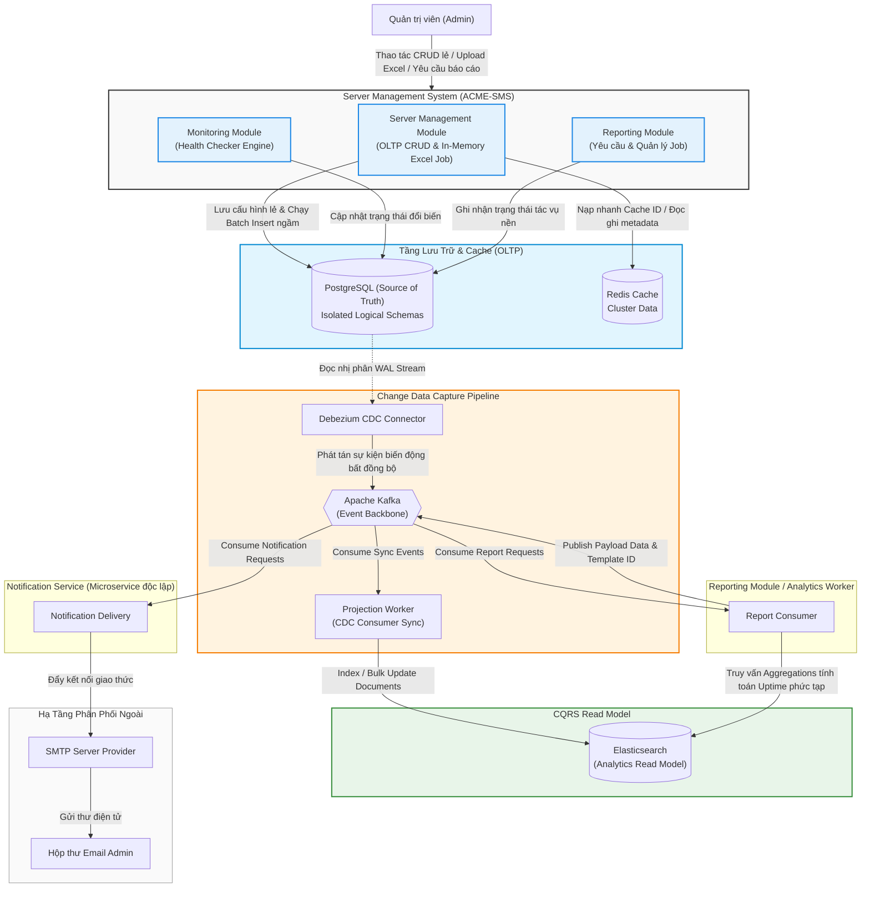
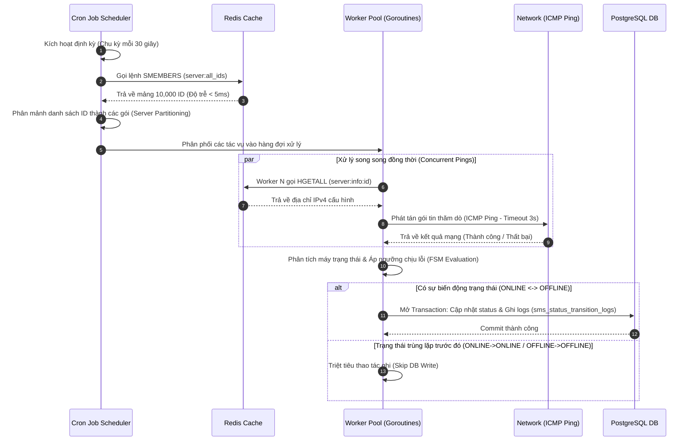
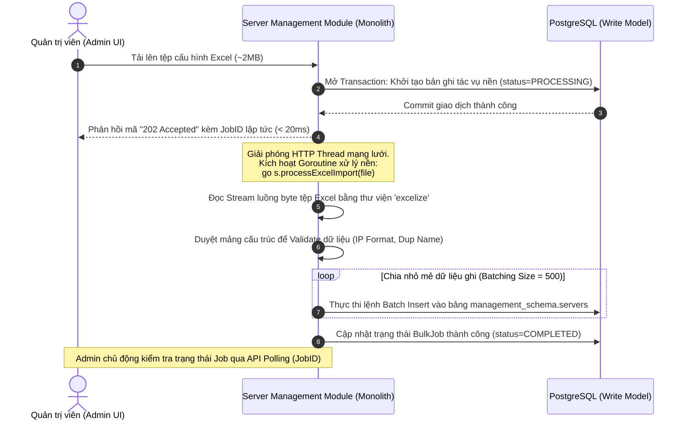
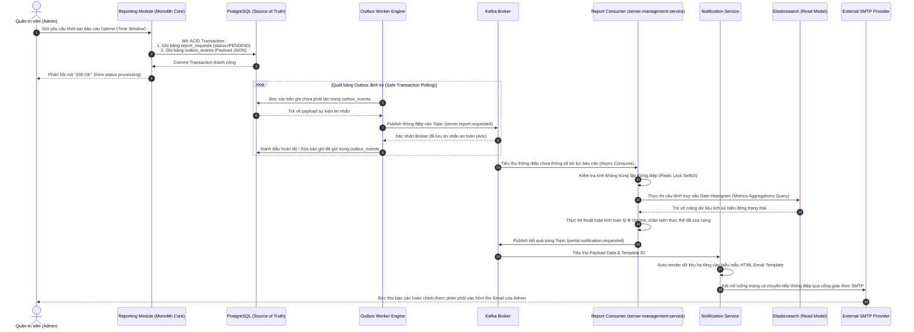

# **TÀI LIỆU THIẾT KẾ KIẾN TRÚC**

## **HỆ THỐNG QUẢN LÝ SERVER (ACME-SMS) \- CHƯƠNG TRÌNH ĐÀO TẠO Acme PASSPORT**

# **1\. Introduction**

## **1.1 Purpose**

Tài liệu thiết kế kiến trúc này mô tả cấu trúc tổng thể, mô hình dữ liệu, cơ chế vận hành bất đồng bộ và các giải pháp đảm bảo thuộc tính chất lượng (Quality Attributes) của hệ thống Quản lý và Giám sát Server (Server Management System \- ACME-SMS). Tài liệu này đóng vai trò là cầu nối kỹ thuật cốt lõi đóng gói các quyết định lớn từ tài liệu Làm rõ yêu cầu & Hồ sơ Quyết định Kiến trúc (Requirement Analysis & ADR), ánh xạ các thành phần chiến lược từ miền nghiệp vụ trong Bản đồ ngữ cảnh (Domain Model & Event Storming) để chuyển đổi thành các đặc tả phân rã module, luồng xử lý và mô hình triển khai chi tiết cho đội ngũ phát triển phần mềm.

## **1.2 Scope**

Tài liệu tập trung bao bọc và làm rõ kiến trúc của các phân hệ chức năng sau:

* **Server Management:** Nghiệp vụ quản lý thực thể (CRUD), tối ưu hóa cấu trúc luồng nhập/xuất dữ liệu lớn qua tệp tin Excel.

* **Monitoring:** Cơ chế lập lịch (Scheduling Engine), kỹ thuật điều phối vùng thực thi (Worker Pool) và chiến lược thăm dò trạng thái qua ICMP Ping mạng lưới.

* **Status History & Uptime Analytics:** Kiến trúc tách biệt truy vấn (CQRS) sử dụng công cụ tổng hợp dòng thời gian và ghi nhận biến động trạng thái để phục vụ tính toán chỉ số sẵn sàng.

* **Reporting:** Vòng đời xử lý yêu cầu báo cáo tự động và báo cáo theo nhu cầu (On-demand).

* **Notification Integration:** Cơ chế tích hợp bất đồng bộ, phân phối và truyền thông điệp qua hạ tầng trung gian tin nhắn đến các dịch vụ vệ tinh ngoại vi.

Tài liệu này giới hạn, không bao gồm: Thiết kế chi tiết giao diện người dùng (UI/UX Design), thiết kế vật lý chi tiết của cơ sở dữ liệu (Database Physical Tuning) và đặc tả chi tiết mã nguồn các cấu trúc điểm cuối API (API Specification).

### **1.3 References**

Tài liệu tham chiếu chéo với các hồ sơ nền tảng trong chương trình đào tạo Acme Passport:

1. Tài liệu phân tích yêu cầu nghiệp vụ và Hồ sơ quyết định kiến trúc cốt lõi.  
2. Tài liệu đặc tả mô hình miền, phân rã Bounded Context và biểu đồ sự kiện Event Storming hệ thống quản lý server.

## 

## 

# **2\. Architectural Drivers**

## **2.1 Business Drivers**

Kiến trúc hệ thống được định hình nhằm đáp ứng các bài toán nghiệp vụ trọng tâm sau:

| Nghiệp vụ (Business Driver) | Đặc tả tính năng kỹ thuật   |
| :---- | :---- |
| **Server Inventory Management** | Cung cấp khả năng quản lý vòng đời toàn diện của các thiết bị hạ tầng: Khai sinh, thay đổi thông tin định danh mạng (IPv4), tên định danh cấu hình độc nhất và xóa thực thể. Hỗ trợ cơ chế tải lên/xuống danh sách (Import/Export Excel) một cách tối ưu. |
| **Availability Monitoring** | Tự động hóa hoàn toàn quy trình quét và thực thi kiểm tra sức khỏe hạ tầng, theo dõi sát sao trạng thái hoạt động (ONLINE/OFFLINE) dựa trên hạ tầng mạng lưới lõi nhằm giảm thiểu tối đa thời gian phát hiện sự cố. |
| **Uptime Tracking** | Tính toán chính xác tỷ lệ sẵn sàng hoạt động (%) của từng máy chủ hoặc toàn bộ cụm hạ tầng theo các cửa sổ thời gian (Time Windows) tùy biến, giải quyết triệt để bài toán loại bỏ khoảng thời gian sai lệch sau khi thiết bị đã bị xóa cứng khỏi hệ thống. |
| **Reporting** | Hệ thống hóa quy trình tổng hợp số liệu hạ tầng, tự động kết xuất dữ liệu và render biểu mẫu HTML Email gửi báo cáo định kỳ hàng ngày cho quản trị viên, hoặc kích hoạt sinh báo cáo tức thời theo yêu cầu. |

## **2.2 Quality Attributes**

* **Scalability (Khả năng mở rộng):** Hệ thống phải đảm bảo năng lực kiểm tra trạng thái đồng thời và liên tục cho ít nhất 10.000+ server với tần suất cao (30 giây mỗi chu kỳ) mà không gây nghẽn cổ chai hệ thống mạng hoặc thắt nút tài nguyên tại tầng dữ liệu.

* **Reliability (Độ tin cậy và Tính toàn vẹn):** Cam kết không làm thất lạc hay bỏ sót bất kỳ sự kiện chuyển đổi trạng thái nào (StatusTransitionEvent) và đảm bảo mọi yêu cầu kết xuất báo cáo (ReportRequest) đều được xếp hàng xử lý an toàn kể cả trong kịch bản sập dịch vụ trung gian nhờ kiến trúc lưu trữ phân tán.

* **Maintainability (Khả năng bảo trì):** Áp dụng phong cách kiến trúc Modular Monolith nhằm duy trì tính gắn kết cao (High Cohesion) và liên kết lỏng (Low Coupling) giữa các khối chức năng, tách biệt các phân vùng lưu trữ logic (Schema Isolation), giúp mã nguồn tường minh, dễ kiểm thử và phát triển song song.

* **Future Expansion (Sẵn sàng tiến hóa):** Toàn bộ các module chức năng được tích hợp thông qua cơ chế trao đổi thông điệp hướng sự kiện (Event-Driven Architecture), đảm bảo hệ thống dễ dàng bóc tách, cô lập và dịch chuyển thành các kiến trúc Microservices độc lập khi quy mô tải tăng trưởng mà không cần đập đi xây lại từ đầu.

## 

# **3\. Architecture Overview**

## **3.1 Architectural Style**

Hệ thống áp dụng phong cách kiến trúc **Modular Monolith (Kiến trúc đơn khối phân rã module)** kết hợp chặt chẽ với phương thức **Tích hợp hướng sự kiện (Event-Driven Integration)**. Mô hình này kết hợp ưu điểm triển khai và vận hành tập trung của một Monolith nhưng mang tư duy thiết kế hệ thống phân tán.

* **Core Domain Partitioning:** Toàn bộ các miền nghiệp vụ cốt lõi (Server Management, Monitoring, Reporting) được cô lập thành các module mã nguồn riêng biệt bên trong một khối ứng dụng duy nhất. Việc chia sẻ dữ liệu trực tiếp ngang hàng giữa các module bị cấm; thay vào đó, các module tương tác thông qua lớp ứng dụng (Application Service Layer) hoặc các hợp đồng giao tiếp rõ ràng.

* **Asynchronous Event-Driven Integration:** Hạ tầng tin nhắn trung gian **Apache Kafka** đóng vai trò làm trục xương sống sự kiện (Event Backbone). Thay vì cho phép các module thực hiện ghi nhận dữ liệu chéo hoặc gọi hàm đồng bộ gây phụ thuộc khóa lẫn nhau (Temporal Coupling), hệ thống sử dụng công nghệ **Change Data Capture (CDC)** thông qua **Debezium** để lắng nghe nhật ký ghi trước (Write-Ahead Log \- WAL) từ cơ sở dữ liệu gốc và phát tán các sự kiện tích hợp một cách bất đồng bộ

* **CQRS Analytics Strategy:** Để xử lý các tác vụ truy vấn chuỗi thời gian nặng và tính toán báo cáo phức tạp không ảnh hưởng tới luồng xử lý giao dịch trực tuyến (OLTP), kiến trúc áp dụng nguyên lý CQRS (Command Query Responsibility Segregation). **PostgreSQL** đóng vai trò là phân vùng ghi (Write Model/Source of Truth), trong khi **Elasticsearch** được sử dụng như một phân vùng đọc chuyên biệt (Read Model/Analytics Store), liên tục được đồng bộ hóa dữ liệu từ Kafka thông qua chuỗi xử lý CDC.

## **3.2 High-Level Architecture Diagram**

Hệ thống Quản lý và Giám sát Server (ACME-SMS) được thiết kế dựa trên sự kết hợp chiến lược giữa mô hình Core nghiệp vụ tập trung và cơ chế phân phối dữ liệu hướng sự kiện phi đồng bộ. Để hiểu rõ cách thức hệ thống vận hành, cấu trúc tương tác và dòng chảy dữ liệu được bóc tách minh bạch thông qua biểu đồ tổng quan dưới đây:

## **3.3 Trọng tâm Đánh đổi Kiến trúc & Đảm bảo Bounded Context**

Nhìn vào sơ đồ tương tác, phân hệ Analytics/Reporting (tính toán Uptime) và phân hệ Notification (gửi email) đã được bóc tách hoàn toàn:

* **Cô lập bằng ranh giới Domain (Bounded Context Isolation):** Hệ thống không bắt Notification Service đi truy vấn Elasticsearch. Việc này bảo toàn sự "trong sạch" cho Notification Service - một dịch vụ trung gian chung chung chỉ nhận và gửi Data.
* **Tối ưu hóa Băng thông Kafka:** `Report Consumer` thực hiện thống kê Analytics từ Elasticsearch, đóng gói dữ liệu và gửi sang Notification Service qua Kafka.
* **Sẵn sàng kiến trúc tiến hóa (Evolutionary Architecture):** Với luồng đi qua Apache Kafka, Notification Service hoàn toàn độc lập, tách biệt khỏi logic của hệ thống cốt lõi.

## **3.3 Architecture Principles**

1. **Principle 1: PostgreSQL là Source of Truth duy nhất.** Mọi trạng thái thực thể, lịch sử thay đổi có giá trị pháp lý giao dịch và dữ liệu đăng ký tác vụ bắt buộc phải được ghi nhận thành công vào PostgreSQL trước khi phát tán ra các hệ thống ngoài.  
2. **Principle 2: Elasticsearch chỉ là Read Model.** Elasticsearch không bao giờ được phép tiếp nhận các câu lệnh ghi dữ liệu trực tiếp từ các hàm API nghiệp vụ. Trạng thái của Elasticsearch hoàn toàn là phái sinh từ PostgreSQL, phục vụ duy nhất mục đích tối ưu hóa hiệu năng tìm kiếm và phân tích truy vấn gộp (Aggregations).  
3. **Principle 3: Mọi tích hợp giữa các dịch vụ/phân hệ lớn đều là bất đồng bộ.** Loại bỏ hoàn toàn kết nối HTTP/gRPC đồng bộ khi giao tiếp xuyên biên giới hệ thống nhằm triệt tiêu hiệu ứng sập dây chuyền (Cascading Failures) và cô lập tài nguyên.  
4. **Principle 4: Tách biệt tuyệt đối giữa phân hệ Monitoring và phân hệ Notification.** Phân hệ quét trạng thái mạng lưới không được phép quan tâm hoặc chờ đợi kết quả gửi thông báo. Nó chỉ làm nhiệm vụ duy nhất là phát hiện và ghi nhận sự kiện chuyển đổi trạng thái vào DB.  
5. **Principle 5: Các module giao tiếp nội bộ nghiêm ngặt qua lớp Application Layer.** Nghiêm cấm hành vi truy vấn chéo dữ liệu trực tiếp tại tầng Repository hoặc liên kết bảng (Join) giữa các Schema thuộc về hai Module khác nhau nhằm bảo toàn tính độc lập của cấu trúc mã nguồn.

## 

# **4\. System Decomposition**

## **4.1 Server Management Module**

* **Trách nhiệm hệ thống:** Phân hệ Quản lý Máy chủ chịu trách nhiệm kiểm soát toàn bộ vòng đời của các thực thể hạ tầng phần cứng trong danh mục cấu hình hệ thống. Phân hệ này tiếp nhận và xử lý các thao tác quản trị trực tuyến có độ trễ thấp từ quản trị viên bao gồm việc khởi tạo thực thể lẻ, truy xuất thông tin, cập nhật thuộc tính định danh mạng và xóa thực thể.

  **Đối với nghiệp vụ nạp dữ liệu hàng loạt bằng tệp Excel (Import)**, bối cảnh quy mô hệ thống quản lý giới hạn ở ngưỡng 10.000 máy chủ, tương đương với kích thước tệp tin thô rất nhỏ, chỉ dao động từ 1MB đến 2MB. Nhằm triệt tiêu rủi ro rơi vào bẫy thiết kế quá đà (Over-engineering) khi bắt hệ thống vận hành một hạ tầng lưu trữ đối tượng độc lập hoặc đẩy thông điệp cồng kềnh qua hệ thống hàng đợi tin nhắn bên ngoài không tương xứng với dung lượng tệp tin, phân hệ tận dụng trực tiếp mô hình bất đồng bộ nội khối thông qua cơ chế luồng mỏng (Goroutine) chạy ngầm ngay bên trong tiến trình và vùng nhớ RAM chung của khối Monolith.

  Khi quản trị viên thực hiện tải tệp lên, ứng dụng thực hiện đọc trực tiếp luồng byte dữ liệu từ HTTP request vào bộ nhớ tạm thời, khởi tạo một bản ghi theo vết công việc nền và ngay lập tức phản hồi mã trạng thái 202 Accepted cho người dùng nhằm giải phóng luồng mạng mạng lưới. Tiến trình xử lý ngầm sau đó sẽ sử dụng cơ chế đọc tệp tối ưu bộ nhớ (Stream Processing), bóc tách cấu trúc dữ liệu và áp dụng kỹ thuật chèn dữ liệu theo khối (Batch Insert với kích cỡ mẻ cố định là 500 dòng/lượt) thẳng xuống PostgreSQL. Giải pháp này giúp bảo vệ hiệu năng đỉnh của hệ thống mạng, giải phóng HTTP worker thread nhưng vẫn đảm bảo cấu trúc gọn sạch, thực dụng và tối ưu chi phí hạ tầng cho doanh nghiệp.  
    
* **Cấu trúc Cốt lõi của Aggregate (Core Aggregate Structure):** Thực thể gốc cấu tạo nên phân hệ là Server Root Aggregate, chịu trách nhiệm thực thi các ràng buộc bất biến về mặt nghiệp vụ đối với từng máy chủ độc lập. Các thuộc tính cốt lõi bao gồm:  
* **Mã định danh máy chủ (ServerID):** Sử dụng định dạng chuỗi ngẫu nhiên chuẩn thế giới UUIDv4 nhằm loại bỏ nguy cơ trùng lặp dữ liệu và ngăn chặn các lỗ hổng bảo mật rò rỉ thông tin hạ tầng khi tăng tiến số tuần tự.  
* **Tên máy chủ (ServerName):** Chuỗi ký tự định danh logic độc nhất toàn hệ thống, áp dụng ràng buộc chống trùng lặp để phục vụ công tác quản lý phân biệt.  
* **Địa chỉ mạng (IPv4 Address):** Địa chỉ IP tĩnh dạng chuỗi cấu hình dùng làm tham số đầu vào gốc cho các lệnh quét kết nối lớp mạng của Worker Pool.  
* **Dấu mốc thời gian hệ thống (System Timestamps):** Bao gồm thời điểm khởi tạo vào kho dữ liệu và thời điểm cập nhật biến động gần nhất, đóng vai trò làm trục thời gian cơ sở cho các phép toán tính toán hiệu năng sẵn sàng phái sinh.

## **4.2 Monitoring Module**

* **Trách nhiệm:** Định kỳ lập lịch kích hoạt các chu kỳ kiểm tra sức khỏe mạng lưới của toàn bộ danh sách server đang hoạt động. Thực thi phân tích phản hồi kỹ thuật, áp dụng các bộ lọc ngưỡng chịu lỗi (Failure Thresholds) và ra quyết định thay đổi trạng thái hoạt động một cách chính xác.  
* **Cấu trúc Aggregate Core:** Phân vùng logic Server Monitoring Snapshot. Theo dõi các biến trạng thái động nhằm phục vụ tính toán chuyển đổi: CurrentStatus (ONLINE/OFFLINE), ConsecutiveFailureCount (Counter), và LastCheckedTime.

## **4.3 Reporting Module**

* **Trách nhiệm:** Quản lý vòng đời của các yêu cầu kết xuất tri thức hạ tầng. Tiếp nhận các tham số thiết lập khoảng thời gian cần thống kê báo cáo, khởi tạo tiến trình xử lý, kiểm soát trạng thái xử lý của báo cáo và đẩy yêu cầu phân tích sang tầng xử lý hậu kỳ.  
* **Cấu trúc Aggregate Core:** ReportRequest Aggregate. Quản lý trạng thái: ReportID (UUIDv4), RequestorID, TimeWindow (Start/End), ExecutionStatus (PENDING/PROCESSING/COMPLETED/FAILED), và CorrelationID.

## **4.4 Integration Module**

* **Trách nhiệm:** Đảm bảo tính nhất quán dữ liệu xuyên suốt giữa các thành phần lưu trữ và dịch vụ vệ tinh ngoại vi. Chịu trách nhiệm vận hành cơ chế Transactional Outbox, quản lý kết nối hạ tầng Apache Kafka Client, xử lý tuần tự hóa/giải tuần tự hóa dữ liệu tin nhắn (Serialization/Deserialization) và đảm bảo tính phân phối tin nhắn chính xác theo thứ tự.

# **5\. Monitoring Architecture**

## **5.1 Monitoring Workflow**

Quy trình thực thi tác vụ kiểm tra trạng thái tự động được vận hành khép kín theo mô hình phi trạng thái tuần hoàn, mô tả chi tiết qua sơ đồ chuỗi khối dưới đây:

## **5.2 Health Check Strategy**

* **Check Type (Phương thức kiểm tra):** Sử dụng giao thức ICMP Ping ở tầng mạng mạng lưới. Đây là giải pháp tối ưu nhất đáp ứng trực tiếp yêu cầu bài toán Checkpoint, giúp kiểm tra nhanh chóng khả năng phản hồi lớp hạ tầng mạng của thiết bị mà không bắt buộc cài đặt các thành phần đặc vụ (Agents) hay mở các cổng dịch vụ ứng dụng trên server mục tiêu.  
* **Interval (Tần suất quét):** Hệ thống thiết lập chu kỳ quét cố định là **30 giây**.  
* **Timeout (Thời gian chờ phản hồi tối đa):** Ngưỡng thời gian cấu hình cho một gói tin thăm dò phản hồi là **3 giây**. Nếu quá thời gian này mà không nhận được tín hiệu trả về, lượt thăm dò đó được tính là một lần thất bại (Probe Failure).

## **5.3 Status Evaluation Strategy**

Để ngăn chặn hiện tượng trạng thái hệ thống bị nhiễu động hoặc dao động liên tục do mất gói tin cục bộ hoặc nghẽn mạng nhất thời (Network Flapping), hệ thống áp dụng bộ lọc trạng thái dựa trên máy trạng thái hữu hạn (Finite State Machine) kết hợp ngưỡng tích lũy:

* **Chuyển sang OFFLINE:** Thực thể server chỉ bị coi là OFFLINE khi hệ thống ghi nhận **2 lần kiểm tra thất bại liên tiếp** (Failure Threshold \= 2). Lần thất bại đơn lẻ đầu tiên sẽ đưa hệ thống vào trạng thái cảnh báo ngầm và không thực hiện thay đổi trạng thái công khai.  
* **Chuyển sang ONLINE:** Khi server đang ở trạng thái OFFLINE, chỉ cần **1 lượt kiểm tra thành công duy nhất** (Recovery Threshold \= 1), hệ thống lập tức tái khôi phục trạng thái sang ONLINE. Điều này đảm bảo tính nhạy bén cao trong việc nhận diện thiết bị hạ tầng đã quay trở lại hoạt động.  
* **Chiến lược ghi nhật ký giảm tải (Write Amplification Reduction):** Hệ thống áp dụng quy tắc nghiêm ngặt: **Chỉ thực hiện ghi dữ liệu xuống cơ sở dữ liệu khi xảy ra sự dịch chuyển trạng thái thực sự** (ONLINE \-\> OFFLINE hoặc OFFLINE \-\> ONLINE). Mọi kết quả quét trùng lặp trạng thái trước đó (ONLINE \-\> ONLINE hoặc OFFLINE \-\> OFFLINE) sẽ bị loại bỏ ngay tại tầng logic của Worker, không sinh ra bất kỳ lệnh Update/Insert nào xuống PostgreSQL. Chiến lược này giúp triệt tiêu tới hơn 95% lượng thao tác ghi đĩa dư thừa, bảo vệ PostgreSQL khỏi thảm họa quá tải đĩa (I/O Bottleneck) khi quản lý hàng vạn thiết bị.

## **5.4 Monitoring Scalability Design**

Để đảm bảo quét sạch 10.000+ server trong hộp thời gian giới hạn nghiêm ngặt mà không gây ra hiện tượng trượt chu kỳ hoặc nghẽn luồng xử lý, kiến trúc triển khai đồng bộ ba giải pháp công nghệ:

1. **Goroutine Worker Pool (Mô hình Concurrency của Go):** Hệ thống khởi tạo một phân vùng tài nguyên xử lý bao gồm một số lượng cấu hình cố định các Worker chạy đồng thời (Goroutines). Mô hình luồng mỏng (Lightweight Threads) của Go cho phép hệ thống duy trì hàng ngàn luồng tính toán song song với chi phí tiêu hao bộ nhớ RAM cực kỳ thấp (chỉ vài KB cho mỗi Goroutine).  
2. **Non-blocking Network Polling & Concurrent Ping:** Tận dụng thư viện ICMP bất đồng bộ của Go, các Worker thực hiện phát tán đồng loạt hàng ngàn gói tin Ping mạng lưới trong cùng một thời điểm. Việc chờ đợi phản hồi mạng (I/O Bound task) của Server A hoàn toàn không gây ảnh hưởng hay làm chậm tiến trình kiểm tra của Server B.  
3. **Server Partitioning & Cache-Driven Loading:** Danh sách 10.000 máy chủ được phân mảnh (Partitioning) thành các gói dữ liệu có kích thước bằng nhau trong hàng đợi bộ nhớ. Thay vì truy vấn trực tiếp vào PostgreSQL để lấy địa chỉ IP của từng Server tại mỗi chu kỳ (gây sập DB vì nghẽn kết nối), hệ thống lưu trữ toàn bộ ánh xạ ServerID \-\> IPv4 trên cấu trúc **Redis Set & Hash**. Tại bước khởi động chu kỳ, Scheduler chỉ gọi một lệnh duy nhất SMEMBERS để lấy danh sách ID và các Worker gọi HGETALL lên Redis với độ trễ phản hồi cực thấp (\<5ms), cô lập hoàn toàn tầng lưu trữ quan hệ khỏi luồng quét mạng trực tuyến.

# **6\. Event-Driven Architecture**

## **6.1 StatusTransitionEvent Flow**

Khi một máy chủ thay đổi trạng thái, dòng chảy sự kiện đồng bộ hóa dữ liệu từ lõi Monolith sang Read Model phục vụ phân tích được tổ chức bất đồng bộ như sau:

```mermaid
graph LR
    subgraph Core ["Phân Hệ Giám Sát (OLTP)"]
        MM["Monitoring Module<br>(Phát hiện đổi trạng thái)"]
        DB[("PostgreSQL Database<br>(Write Model)")]
        WAL["Postgres WAL<br>(Write-Ahead Log)"]
    end

    subgraph Streaming ["Hạ Tầng Tích Hợp Bất Đồng Bộ"]
        Debezium["Debezium CDC Connector"]
        Kafka{{"Kafka Topic:<br>sms.status.transition"}}
    end

    subgraph Consumer ["Phân Hệ Phân Tích (OLAP)"]
        Worker["Projection Worker<br>(Sync Service)"]
        ES[("Elasticsearch<br>(Read Model Index)")]
    end

    %% Dòng chảy dữ liệu
    MM -->|Ghi log giao dịch ACID| DB
    DB -->|Sinh log nhị phân tuần tự| WAL
    WAL -.->|Lắng nghe luồng nhị phân ngầm| Debezium
    Debezium -->|Đóng gói JSON & Publish| Kafka
    Kafka -->|Consume Asynchronously| Worker
    Worker -->|Thực thi Bulk Index / Update| ES

    %% Định dạng màu sắc
    style Core fill:#f0f4c3,stroke:#afb42b,stroke-width:2px;
    style Streaming fill:#ffe0b2,stroke:#f57c00,stroke-width:2px;
    style Consumer fill:#e0f2f1,stroke:#00695c,stroke-width:2px;
```

## **6.2 Excel Import Flow**

Quy trình xử lý nạp danh sách máy chủ hàng loạt bằng tệp Excel được thực thi nền thông qua Goroutines nhằm không làm ảnh hưởng độ trễ của API chính:

## **6.3 CDC Architecture**

* **Lý do lựa chọn giải pháp Debezium:** Trong kiến trúc Microservices và Modular Monolith truyền thống, mô hình "Dual-Write" (Ứng dụng vừa thực hiện ghi vào DB, vừa chủ động gọi thư viện để gửi tin nhắn sang Kafka) là một mô thức chống mẫu nguy hiểm (Anti-pattern). Nếu DB ghi thành công nhưng Kafka bị lỗi mạng, dữ liệu sẽ mất tính nhất quán. Nếu đảo ngược thứ tự, hệ thống có rủi ro phát tán tin nhắn rác nếu DB sau đó bị Rollback. Bằng cách sử dụng Debezium kết nối trực tiếp vào tầng lưu trữ nhật ký giao dịch WAL (Write-Ahead Log) cấp thấp của Postgres, hệ thống tách biệt hoàn toàn tầng ứng dụng khỏi trách nhiệm phát tán sự kiện. Giao dịch nghiệp vụ chạy với tốc độ tối đa, và mọi biến động dữ liệu được cam kết phát tán sang Kafka một cách an toàn tuyệt đối.  
* **Lợi ích hệ thống (System Architecture Benefits):**  
  * *Decoupling (Khử phụ thuộc sâu):* Mã nguồn Core API không cần cài đặt hoặc duy trì kết nối đến SDK của Kafka, loại bỏ hoàn toàn các thư viện phân tán phức tạp khỏi lõi nghiệp vụ.  
  * *Scalability (Năng lực mở rộng tải):* Áp dụng cơ chế lưu vết Offsets của Kafka giúp hệ thống chịu tải kéo (Pull-based). Nếu phân hệ Elasticsearch hoặc Notification bị quá tải hoặc tạm thời dừng hoạt động để bảo trì, tin nhắn vẫn được xếp hàng an toàn trên Kafka và tự động xử lý bù (Catch-up) khi các dịch vụ này phục hồi mà không làm mất mát dữ liệu.  
  * *Microservice Evolution (Sẵn sàng bóc tách):* Kiến trúc này cho phép dịch vụ Notification Service tồn tại độc lập như một dịch vụ vệ tinh chạy bằng ngôn ngữ khác, có cơ sở dữ liệu theo vết giao dịch riêng, dễ dàng co giãn số lượng bản sao (Scale-out) dựa trên mật độ tin nhắn trong Kafka Topic.

# **7\. Data Architecture**

## **7.1 PostgreSQL**

* **Vai trò trong hệ thống:** Đóng vai trò là phân vùng ghi (Command Side), là nguồn chân lý dữ liệu gốc duy nhất (Source of Truth) của toàn hệ thống, bảo toàn tính toàn vẹn dữ liệu thông qua cơ chế ràng buộc chặt chẽ và giao dịch ACID.  
* **Tổ chức phân vùng dữ liệu và bảng:** Hệ thống sử dụng cơ chế cô lập logic bằng các Schemas riêng biệt để chuẩn bị sẵn cho việc tách DB vật lý sau này:  
  * management\_schema.servers: Lưu trữ hồ sơ định danh, cấu hình mạng và trạng thái hiện tại của máy chủ.  
  * monitoring\_schema.sms\_status\_transition\_logs: Lưu vết dòng thời gian các sự kiện dịch chuyển trạng thái thực tế phục vụ kiểm toán hạ tầng.  
  * reporting\_schema.report\_requests: Quản lý vòng đời và trạng thái thực thi của các tác vụ xuất báo cáo.  
  * integration\_schema.outbox\_events: Lưu trữ tạm thời các Payload sự kiện tích hợp dưới dạng JSON trong cùng một ranh giới giao dịch của ứng dụng.

## **7.2 Redis**

* **Vai trò trong hệ thống:** Đóng vai trò là tầng đệm tốc độ cao (In-Memory Cache Layer) và quản lý điều phối phân tán.  
* **Cấu trúc tổ chức dữ liệu:**  
  * Cấu trúc Set (Key: server:all\_ids): Lưu trữ tập hợp tất cả các mã định danh ServerID đang hoạt động trong hệ thống để Worker Pool nạp nhanh trong vòng vài mili-giây.  
  * Cấu trúc Hash (Key: server:info:\<server\_id\>): Lưu trữ ánh xạ dữ liệu tĩnh bao gồm ipv4 và server\_name để phục vụ kiểm tra kết nối mạng không qua DB.  
  * Distributed Lock (Redlock): Sử dụng chuỗi khóa phân tán trên Redis để bảo vệ tiến trình kích hoạt Cron Job của phân hệ Monitoring, đảm bảo tại một thời điểm chỉ có duy nhất một thực thể Monolith được quyền kích hoạt Worker Pool quét mạng, tránh xung đột tài nguyên mạng.

## **7.3 Kafka**

* **Vai trò trong hệ thống:** Trục xương sống truyền thông điệp (Event Backbone), đảm bảo phân phối tin nhắn theo mô hình "At-least-once" và giữ nguyên thứ tự sắp xếp sự kiện dựa trên khóa định danh (Partition Key).  
* **Danh sách các Topics cốt lõi:**  
  * portal.public.servers: Luồng sự kiện CDC đồng bộ cấu hình nền tảng.  
  * portal.public.sms\_status\_transition\_logs: Luồng sự kiện chuyển đổi trạng thái mạng phục vụ cập nhật Read Model của Elasticsearch.  
  * server.report.requested: Hàng đợi phân phối các yêu cầu kết xuất báo cáo cho Notification Service xử lý.

## **7.4 Elasticsearch**

* **Vai trò trong hệ thống:** Đóng vai trò là phân vùng đọc chuyên biệt (Read Model / Analytics Engine) phục vụ CQRS. Chịu trách nhiệm thực thi các phép toán truy vấn dữ liệu chuỗi thời gian (Time-series queries) hạng nặng.  
* **Ứng dụng lưu trữ:** Toàn bộ lịch sử đổi trạng thái của server được đánh chỉ mục (Index) vào Elasticsearch. Khi cần tìm kiếm nâng cao, tra cứu biểu đồ dòng thời gian biến động trạng thái (History Timeline) hoặc thực hiện các phép truy vấn gộp phức tạp (Elasticsearch Metrics Aggregations) để tính toán tỷ lệ sẵn sàng hoạt động, hệ thống sẽ khai thác năng lực tính toán phân tán của Elasticsearch thay vì bắt PostgreSQL quét hàng triệu dòng dữ liệu.

# **8\. Reporting Architecture**

## **8.1 Report Generation Workflow**

Quy trình xử lý hoàn chỉnh một yêu cầu báo cáo, từ lúc tiếp nhận tín hiệu đến khi phân tích dữ liệu trên Elasticsearch và phân phối thư qua SMTP:

## **8.2 Uptime Calculation**

Để đảm bảo tính công bằng và chính xác tuyệt đối của chỉ số sẵn sàng hoạt động, thuật toán của hệ thống không tính toán dựa trên số lượt Ping thành công/thất bại (mô hình tính toán sai lệch), mà dựa trên tổng thời gian thực tế mà Server duy trì trạng thái ONLINE bên trong cửa sổ quan sát.  
Công thức toán học chuẩn chỉnh áp dụng trong mã nguồn được định nghĩa như sau:

**Công thức tính tỷ lệ Uptime của một thiết bị độc lập:**

**Uptime (%) \=** Total Online Duration in Window (*Tonline*) / Effective Observation Duration (*Teffective*) **× 100**

**Trong đó, thuật toán xác định biên Effective Observation Duration để xử lý bài toán xóa cứng thiết bị:**

**Teffective** \= min(Tend, Tterminate) \- max(Tstart, Tcreate)

**Các tham số định nghĩa:**

* *Tstart* / *Tend*: Mốc thời gian bắt đầu và kết thúc của cửa sổ bộ lọc báo cáo do người dùng yêu cầu.  
* *Tcreate*: Thời điểm thực tế máy chủ được khởi tạo vào hệ thống Inventory.  
* *Tterminate*: Thời điểm máy chủ bị xóa cứng (nhận sự kiện TERMINATED). Nếu máy chủ chưa bị xóa, giá trị này mặc định bằng *Tend*.

**Ý nghĩa nghiệp vụ***:* Biện pháp giới hạn biên tự động này giúp công ty Acme tính toán chính xác tỷ lệ sẵn sàng hoạt động của hạ tầng thiết bị mà không bị tính phạt oan hoặc gây sai lệch số liệu trong khoảng thời gian sau khi server đã bị gỡ bỏ ra khỏi hệ thống phần cứng thực tế.

## **8.3 Report Format**

Báo cáo kết xuất cấu trúc dưới dạng biểu mẫu định dạng **HTML Email** thiết kế chỉn chu, hiển thị trực quan các nhóm tri thức hạ tầng bao gồm:

* **Server Inventory Summary:** Tổng số lượng máy chủ phân bổ toàn công ty, số lượng máy chủ hoạt động bình thường, và tỷ lệ Uptime trung bình toàn cụm hạ tầng.  
* **Uptime Metric Details:** Bảng liệt kê chi tiết chỉ số Uptime (%) của từng máy chủ cụ thể, sắp xếp từ cao xuống thấp.  
* **Downtime Blacklist:** Danh sách đen các máy chủ có thời gian chết lớn nhất trong chu kỳ, hiển thị rõ tổng số lần xảy ra sự cố (Downtime Incidents) và tổng số phút không thể kết nối để đội vận hành ứng cứu khẩn cấp.  
* **Historical Trend Statistics:** Biểu đồ chuỗi thời gian biểu diễn xu hướng biến động trạng thái sẵn sàng của toàn công ty qua các ngày trong tuần.

# **9\. Reliability & Scalability Considerations**

## **9.1 Reliability (Đảm bảo độ tin cậy hệ thống)**

* **Transactional Integrity via Outbox Pattern:** Để loại bỏ hoàn toàn rủi ro lỗi "Dual-Write", phân hệ Reporting và Server Management lưu giữ các sự kiện cần phát tán trực tiếp vào bảng outbox\_events trong cùng một khối Transaction điều khiển nghiệp vụ chính. Nếu tiến trình ghi dữ liệu gốc thất bại, toàn bộ sự kiện tích hợp bị hủy bỏ, cam kết không bao giờ phát tán thông tin rác lên Kafka.  
* **Guaranteed Messaging via Kafka & CDC:** Hạ tầng Apache Kafka được cấu hình với thuộc tính acks=all và các phân vùng dữ liệu được sao lưu (Replication Factor \>= 3). Debezium liên tục theo dõi vị trí đọc nhật ký (Log Offsets), đảm bảo kể cả khi có sự cố sập nguồn phần cứng đột ngột, hệ thống vẫn có khả năng khôi phục dòng chảy dữ liệu một cách chính xác mà không làm thất lạc bất kỳ thông điệp nào.  
* **Idempotency & Fault Tolerance in Notification Service:** Dịch vụ vệ tinh Notification Service được thiết kế theo mô hình tiêu thụ thông điệp có khả năng kháng trùng lặp dữ liệu (Idempotent Consumer). Dịch vụ duy trì một bảng lưu vết trạng thái phân phối (NotificationDelivery) sử dụng khóa độc nhất EventID/CorrelationID của sự kiện làm ràng buộc primary key. Nếu Kafka gửi lặp lại một thông điệp do mất mạng kết nối xác nhận (Ack), dịch vụ lập tức nhận diện và bỏ qua lượt xử lý dư thừa, ngăn chặn tuyệt đối thảm họa gửi lặp lại nhiều Email trùng nội dung tới khách hàng. Đồng thời, dịch vụ tích hợp cơ chế tự động thử lại với độ trễ lũy thừa (Exponential Backoff) và mẫu thiết kế ngắt mạch (Circuit Breaker) sử dụng gobreaker để cô lập lỗi khi nhà cung cấp dịch vụ SMTP trung gian gặp sự cố.

## **9.2 Scalability (Đảm bảo năng lực mở rộng tải)**

* **Monitoring Horizontal Expansion:** Do phân hệ quét trạng thái được thiết kế hoàn toàn phi trạng thái (Stateless), lấy cấu hình từ Redis Cache và đẩy kết quả sang Kafka, chúng ta có thể dễ dàng tăng hiệu năng quét mạng bằng cách bổ sung thêm số lượng Worker Goroutines hoặc triển khai nhân bản thêm nhiều thực thể Monolith chạy song song (Horizontal Scale-out) mà không gặp bất kỳ xung đột dữ liệu nào.  
* **Analytics Isolation via Elasticsearch:** Việc bóc tách toàn bộ hạ tầng truy vấn lịch sử và tính toán Uptime nặng sang Elasticsearch giúp giải phóng hoàn toàn tài nguyên CPU/RAM cho PostgreSQL. Hệ thống OLTP lõi luôn giữ vững trạng thái ổn định với độ trễ tối thiểu (Low Latency), phục vụ mượt mà hàng ngàn thao tác cập nhật danh mục của quản trị viên cùng lúc.  
* **Integration Decoupling via Kafka:** Sử dụng cơ chế phân mảnh dữ liệu (Partitioning) trong Kafka dựa trên khóa cấu trúc ServerID giúp hệ thống có thể xử lý song song thông điệp trên nhiều nút tính toán độc lập nhưng vẫn bảo toàn tuyệt đối tính tuần tự thời gian của các sự kiện thuộc về cùng một máy chủ cụ thể.

## **9.3 Future Expansion (Định hướng lộ trình tiến hóa Microservices)**

Kiến trúc thiết kế hiện tại đã cô lập hoàn toàn ranh giới dữ liệu và phương thức giao tiếp của các Module. Khi quy mô hệ thống tăng trưởng vượt ngưỡng đáp ứng của một khối Monolith (ví dụ tăng lên 100.000+ Servers), đội ngũ kỹ thuật có thể dễ dàng thực hiện bóc tách hệ thống thành các dịch vụ Microservices biệt lập:

* **Notification Service:** Hiện tại đã là một dịch vụ vệ tinh độc lập bên ngoài, tiêu thụ dữ liệu từ Kafka Topic, tách biệt hoàn toàn về mặt vật lý.  
* **Analytics Service:** Di dời toàn bộ Module Reporting và Projection Worker ra một dự án mã nguồn riêng, sở hữu độc quyền công cụ Elasticsearch, giải phóng hoàn toàn mã nguồn lõi khỏi các thư viện phân tích dữ liệu.  
* **Alert Service (Dịch vụ cảnh báo tức thời):** Dễ dàng bổ sung một dịch vụ mới kết nối vào Kafka Topic sms.status.transition để lắng nghe các sự kiện đổi trạng thái sang OFFLINE, thực thi kiểm tra cấu hình cảnh báo và bắn tin nhắn khẩn cấp qua Telegram, SMS, hoặc hệ thống giám sát tập trung mà không cần chỉnh sửa bất kỳ dòng mã nào trong hệ thống Server Management hiện tại.

# 

# **10\. Architecture Decision Summary**

Bảng tổng hợp dưới đây hệ thống hóa toàn bộ các quyết định kiến trúc chiến lược, biện minh kỹ thuật cùng các giải pháp quản trị rủi ro vận hành:

| Thành phần (Component) | Giải pháp lựa chọn (Choice) | Lý do kỹ thuật (Architectural Justification) | Rủi ro hệ thống & Cách giảm thiểu (Risks & Mitigation)   |
| :---- | :---- | :---- | :---- |
| **Architecture Style** | Modular Monolith | Tối ưu hóa tốc độ phát triển (Time-to-market), triển khai vận hành tập trung, giảm thiểu chi phí quản lý hạ tầng mạng phức tạp ở giai đoạn đầu nhưng vẫn đảm bảo tính cô lập dữ liệu logic thông qua phân tách Schema rõ ràng. | **Rủi ro:** Lập trình viên vô tình gọi chéo mã nguồn vi phạm ranh giới module. **Giảm thiểu:** Sử dụng các công cụ rà soát mã nguồn tự động (Linter/ArchUnit) trong chuỗi CI/CD để chặn mã nguồn vi phạm cấu trúc. |
| **Integration Method** | Asynchronous Event-Driven | Triệt tiêu tính phụ thuộc thời gian giữa các khối chức năng. Giúp API ghi nhận cấu hình phản hồi tức thì với độ trễ cực thấp, nâng cao trải nghiệm người dùng cuối. | **Rủi ro:** Tính nhất quán chậm (Eventual Consistency) khiến dữ liệu trên Elasticsearch bị trễ vài mili-giây. **Giảm thiểu:** Thiết kế giao diện UI xử lý bất đồng bộ (Loading states/Websockets thông báo). |
| **Monitoring Interval** | 30 seconds | Cân bằng tối ưu giữa năng lực phát hiện sớm sự cố downtime hạ tầng (dưới 1 phút) và mức độ chiếm dụng tài nguyên băng thông mạng lưới toàn công ty. | **Rủi ro:** Quá tải hạ tầng mạng nội bộ khi số lượng máy chủ tăng lên. **Giảm thiểu:** Cấu hình thuật toán chia gói dữ liệu (Server Partitioning) để rải đều gói tin trong khoảng chu kỳ 30s. |
| **Offline Threshold** | 2 Consecutive Failures | Loại bỏ nhiễu động dữ liệu mạng (Network Flapping), ngăn chặn việc kích hoạt báo động sai hoặc ghi nhận nhật ký rác khi có hiện tượng mất gói tin cục bộ. | **Rủi ro:** Chậm trễ phát hiện sự cố mất kết nối trong vòng tối đa 1 chu kỳ quét. **Giảm thiểu:** Đây là mức độ đánh đổi kỹ thuật được chấp nhận (Trade-off) để đổi lấy sự ổn định của hệ thống dữ liệu. |
| **Primary Storage** | PostgreSQL | Đảm bảo chân lý dữ liệu tuyệt đối nhờ tính tuân thủ giao dịch ACID mạnh mẽ, khả năng quản lý cấu trúc quan hệ phức tạp và hỗ trợ xuất sắc cơ chế Logical Replication. | **Rủi ro:** Nút thắt cổ chai về hiệu năng ghi (Write Amplification) khi hệ thống liên tục cập nhật trạng thái quét. **Giảm thiểu:** Triển khai bộ lọc máy trạng thái chỉ ghi xuống DB khi có biến động thực sự, giảm 95% tải ghi. |
| **Read Model Store** | Elasticsearch | Tốc độ thực thi các câu lệnh truy vấn gộp chuỗi thời gian cực nhanh nhờ kiến trúc chỉ mục ngược (Inverted Index) và phân tán tài nguyên tính toán trên các Shards, bảo vệ Postgres khỏi các câu lệnh quét dữ liệu nặng. | **Rủi ro:** Mất mát dữ liệu Read Model nếu cụm Elasticsearch bị sập. **Giảm thiểu:** Elasticsearch hoàn toàn có thể tái tạo (Rebuild) bằng cách cho Debezium quét lại toàn bộ dữ liệu (Snapshot) từ PostgreSQL từ đầu. |
| **Messaging Broker** | Apache Kafka (KRaft) | Khả năng chịu tải cực cao (High Throughput), lưu trữ tin nhắn bền vững trên đĩa cứng, cho phép nhiều nhóm dịch vụ cùng tiêu thụ một nguồn sự kiện một cách độc lập. | **Rủi ro:** Cấu hình sai dẫn đến mất thứ tự sự kiện chuyển đổi trạng thái mạng. **Giảm thiểu:** Sử dụng định danh độc nhất ServerID làm khóa phân vùng (Partition Key) nhằm ép buộc các sự kiện của một server luôn đi vào cùng một phân vùng xử lý tuần tự. |
| **Data Capture Pipeline** | Debezium CDC | Triệt tiêu hoàn toàn mã nguồn tích hợp lặp lại tại tầng ứng dụng, hiện thực hóa mô hình gom sự kiện trực tiếp từ WAL của Postgres, giải quyết triệt để bài toán an toàn giao dịch hệ thống. | **Rủi ro:** Tạo thêm áp lực đọc đĩa tăng trưởng dung lượng tệp tin lưu nhật ký WAL trên Postgres. **Giảm thiểu:** Thực hiện giám sát chặt chẽ tham số cấu hình lưu giữ WAL (WAL Retention Policies) và kích hoạt giám sát dung lượng đĩa. |
| **Reporting Execution** | Asynchronous Workers | Biến các tác vụ nặng có nguy cơ gây nghẽn hoặc sập hệ thống (OOM) thành một chuỗi các luồng xử lý xếp hàng tuần tự mượt mà, bảo vệ tính sẵn sàng của Core API. | **Rủi ro:** Người dùng kích hoạt bấm liên tục nút xuất báo cáo tạo nhiều tác vụ trùng lặp. **Giảm thiểu:** Sử dụng Redis Distributed Lock khóa chặn theo mã AdminID trong vòng 60 giây cho mỗi lượt nhấn. |
| **Notification Service** | Decoupled Satellite Service | Cô lập hoàn toàn hạ tầng giao tiếp với bên thứ ba (SMTP). Đảm bảo phân hệ gửi mail có thể tự do bảo trì, nâng cấp, co giãn tải độc lập mà không làm gián đoạn lõi quản lý server. | **Rủi ro:** Nhà cung cấp dịch vụ SMTP từ chối kết nối hoặc bị timeout mạng cục bộ. **Giảm thiểu:** Tích hợp thư viện gobreaker ngắt mạch tự động, chuyển thông điệp lỗi liên tục vào hàng đợi Dead Letter Queue (DLQ) để xử lý thủ công sau. |

